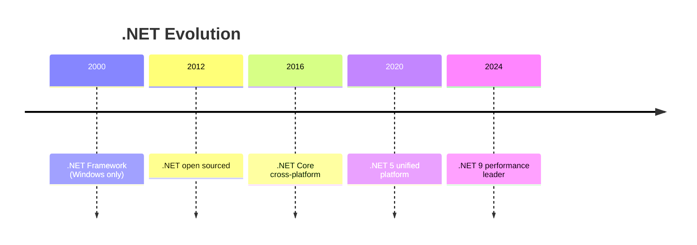

# What Is C# and .NET

## The Language and the Platform

C# is the language. .NET is the platform. They are separate but inseparable in practice.

- **C#** -- a general-purpose, strongly-typed, object-oriented language designed by Anders Hejlsberg at Microsoft
- **.NET** -- the runtime, libraries, and tools that execute C# code and provide the standard library, web framework, ORM, and more

You write C#. You build on .NET.

## History

| Year | Event |
|------|-------|
| 2000 | Microsoft announces C# at PDC. Anders Hejlsberg leads the design. |
| 2002 | C# 1.0 ships with .NET Framework 1.0. Windows-only. |
| 2007 | C# 3.0 introduces LINQ. A turning point for the language. |
| 2012 | C# 5.0 introduces async/await. Another turning point. |
| 2014 | Microsoft open sources the Roslyn compiler. |
| 2016 | .NET Core 1.0 ships. Cross-platform, open source, modular. The reboot. |
| 2020 | .NET 5 unifies .NET Core and Mono. No more "Core" branding. |
| 2022 | .NET 7. C# 11. Performance leadership in web benchmarks. |
| 2024 | .NET 9 (LTS). C# 13. Mature, fast, cross-platform. |
| 2025 | .NET 10 approaching. Continued performance and language evolution. |

## Anders Hejlsberg

The chief designer of C# previously created Turbo Pascal and led the development of Delphi at Borland. He brought a philosophy of developer productivity, strong typing, and pragmatic language design. His influence is why C# feels opinionated but practical -- it favors clarity over cleverness.

## The Open Source Shift

Before 2016, .NET was Windows-only and closed-source. .NET Framework (the original) still exists for legacy applications but receives only security updates.

The modern .NET (formerly .NET Core) is:

- **Open source** -- MIT license, on GitHub (dotnet org)
- **Cross-platform** -- Linux, macOS, Windows
- **Modular** -- install only what you need via NuGet packages
- **High-performance** -- consistently top-tier in TechEmpower benchmarks

## Enterprise Heritage

.NET's enterprise roots are a strength, not a weakness:

- **Stack Overflow** serves millions of daily requests on fewer than 12 servers running .NET
- **Microsoft** runs Azure, Teams, Office 365 backends, and GitHub on .NET
- **Accenture**, **Siemens**, **GoDaddy** use .NET for large-scale systems

The ecosystem includes first-party solutions for authentication (ASP.NET Core Identity), real-time communication (SignalR), gRPC, ORM (EF Core), and more. You rarely need third-party alternatives for core infrastructure.

## What .NET Includes

When you install .NET, you get:

- **Runtime** (CLR) -- garbage collection, JIT compilation, thread management
- **Base Class Library** (BCL) -- collections, file I/O, networking, JSON, threading
- **ASP.NET Core** -- web framework for APIs, web apps, real-time
- **EF Core** -- object-relational mapper for database access
- **CLI tools** -- `dotnet` command for creating, building, testing, publishing
- **SDK** -- compilers (Roslyn), templates, diagnostics tools

All maintained by Microsoft. All open source. All covered by the MIT license.

## The Release Cadence

.NET ships a new version every November. Even-numbered versions (8, 10) are LTS (Long Term Support) with 3 years of patches. Odd-numbered versions (9) are current releases with 18 months of support.

For production: target LTS. For learning: use the latest.
