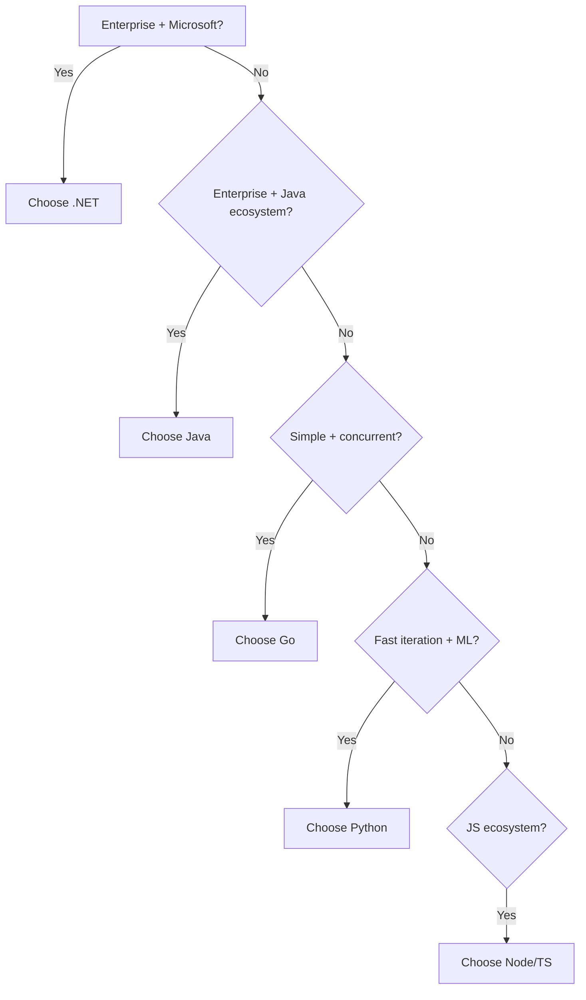

# Why .NET, Why Not X

No technology is the best choice for every situation. Here is how .NET compares to its main competitors for backend development.

## .NET vs Java (Spring Boot)

| Factor | .NET (C#) | Java (Spring Boot) |
|--------|-----------|-------------------|
| Language | C# 13 -- records, pattern matching, LINQ, primary constructors | Java 21+ -- records, pattern matching (preview), streams |
| Performance | Higher throughput in most benchmarks | Good, but JVM warmup can be slow |
| DI/Config | Built into ASP.NET Core, minimal setup | Spring Boot has extensive auto-configuration |
| Ecosystem | NuGet (400K+ packages) | Maven Central (millions of packages) |
| Learning curve | Lower -- fewer abstractions | Higher -- Spring ecosystem is vast |

Choose .NET when you want a modern language with less boilerplate and higher throughput. Choose Java when your organization has deep Java expertise or needs a specific Java-only library.

## .NET vs Go

| Factor | .NET | Go |
|--------|------|-----|
| Runtime | CLR with JIT (or Native AOT) | Compiled to static binary |
| Startup | Moderate (fast with Native AOT) | Very fast |
| Memory | Higher (GC tuning available) | Lower |
| Expressiveness | High -- LINQ, async/await, generics | Low -- simplicity is the design goal |
| Concurrency | async/await, Task, Parallel | Goroutines and channels |
| ORM | EF Core (full-featured) | Limited -- most Go devs use raw SQL |

Choose .NET when you need a rich ORM, complex business logic, or a feature-rich language. Choose Go when you need minimal memory footprint, very fast cold starts, or single-binary deployment simplicity.

## .NET vs Python

| Factor | .NET | Python |
|--------|------|--------|
| Type system | Compiled, strongly typed, nullable reference types | Dynamic typing (type hints optional) |
| Performance | 10-100x faster for CPU-bound work | Slow (C extensions help) |
| Data science | Growing (ML.NET, TorchSharp) | Dominant (NumPy, Pandas, PyTorch) |
| Backend frameworks | ASP.NET Core | Django, Flask, FastAPI |
| Enterprise fit | Strong -- compile-time safety, refactoring | Weaker -- runtime errors, scaling challenges |

Choose .NET for production backend systems where performance and type safety matter. Choose Python for data science, ML prototyping, scripting, and rapid prototyping.

## .NET vs Node.js (TypeScript)

| Factor | .NET | Node.js |
|--------|------|---------|
| Type system | Compiled, strongly typed, nullable reference types | TypeScript (opt-in, structural typing) |
| Performance | Significantly higher throughput | Adequate for most APIs |
| CPU-intensive work | Excellent (true multi-threading) | Offload to worker threads |
| Real-time | SignalR (first-party) | Socket.IO, ws |
| Package ecosystem | NuGet | npm (largest, quality varies) |

Choose .NET when performance matters, you have CPU-intensive work, or you prefer compile-time safety. Choose Node.js when your team is full-stack JavaScript or you need fast UI-related backend iteration.

## The Enterprise Angle

.NET's enterprise heritage is a practical advantage:

- **Predictable release cadence** -- new versions every November, LTS every two years
- **First-party solutions** -- you do not need third-party libraries for auth, ORM, logging, real-time, health checks
- **Microsoft support** -- paid support plans available for organizations that need them
- **Azure integration** -- first-class support for Azure services, but not Azure-locked

## When .NET Is the Wrong Choice

- Your team has zero C# experience and the project timeline does not allow learning
- You need a specific library only available in another ecosystem
- You are building data science / ML pipelines (Python dominates)
- You need a single static binary for embedded or edge deployment (Go is better suited, though .NET Native AOT is closing this gap)
