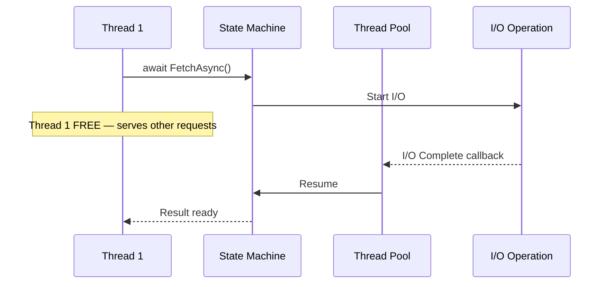

# Async/Await


## Why Async Matters

A web server handles requests on threads from a thread pool. There are a limited number of threads. When a thread waits for I/O (database query, HTTP call, file read), it is blocked and unavailable for other requests.

Async/await lets a thread start an I/O operation and return to the pool while waiting. When the operation completes, a thread picks up where it left off. One thread handles many concurrent operations.

ASP.NET Core is async throughout. Your code should be too.

## Basic Usage

```csharp
// Async method -- returns Task<T>
public async Task<User> GetUserAsync(int id)
{
    return await _dbContext.Users.FindAsync(id)
        ?? throw new NotFoundException($"User {id} not found");
}

// Calling it
var user = await GetUserAsync(42);
```

Every async method returns `Task` (no result) or `Task<T>` (with result). The `await` keyword suspends the method until the task completes.

## The State Machine

When you write `async`, the C# compiler generates a state machine struct. It tracks which `await` point the method is at and resumes execution when the awaited task completes.



```csharp
// What you write:
public async Task<OrderResult> ProcessOrderAsync(int orderId)
{
    var order = await _db.Orders.FindAsync(orderId);   // await point 1
    var payment = await _paymentService.ChargeAsync(order); // await point 2
    order.Status = OrderStatus.Paid;
    await _db.SaveChangesAsync(); // await point 3
    return new OrderResult(order.Id, payment.TransactionId);
}

// What the compiler generates (simplified):
// A state machine with states 0, 1, 2, 3
// Each state corresponds to an await point
// The state machine can be suspended and resumed without blocking a thread
```

You do not need to understand the generated code, but knowing it exists explains why async works and why you should avoid mixing sync and async.

## Task vs ValueTask

- **`Task<T>`** -- allocated on the heap. Used for operations that genuinely run asynchronously.
- **`ValueTask<T>`** -- can avoid heap allocation when the result is available synchronously. Use for hot paths where the result is often cached.

```csharp
// ValueTask for a method that may return synchronously from cache
private readonly ConcurrentDictionary<int, User> _cache = new();

public ValueTask<User> GetUserAsync(int id)
{
    if (_cache.TryGetValue(id, out var cached))
        return new ValueTask<User>(cached); // No allocation

    return new ValueTask<User>(LoadFromDbAsync(id)); // Async path
}

private async Task<User> LoadFromDbAsync(int id) =>
    await _dbContext.Users.FindAsync(id);
```

Rule: default to `Task<T>`. Switch to `ValueTask<T>` only when profiling shows allocation overhead matters.

## ConfigureAwait

```csharp
// In ASP.NET Core, ConfigureAwait(false) is unnecessary -- there is no SynchronizationContext
var data = await _httpClient.GetStringAsync(url);

// In library code, use ConfigureAwait(false) to avoid capturing context
var data = await _httpClient.GetStringAsync(url).ConfigureAwait(false);
```

In ASP.NET Core applications, you do not need `ConfigureAwait(false)`. Use it in library code that may run in contexts with a SynchronizationContext (WPF, WinForms, legacy ASP.NET).

## Cancellation

Pass `CancellationToken` to async methods so callers can cancel long-running operations:

```csharp
public async Task<List<Product>> GetProductsAsync(
    int page, int size, CancellationToken ct = default)
{
    return await _dbContext.Products
        .OrderBy(p => p.Name)
        .Skip((page - 1) * size)
        .Take(size)
        .ToListAsync(ct); // EF Core checks the token
}
```

ASP.NET Core automatically cancels the token when the client disconnects.

## Common Mistakes

### Never Use async void

```csharp
// WRONG -- cannot be awaited, exceptions crash the process
public async void SaveOrder(Order order)
{
    await _db.SaveChangesAsync();
}

// CORRECT -- returns Task
public async Task SaveOrderAsync(Order order)
{
    await _db.SaveChangesAsync();
}
```

### Never Block on Async

```csharp
// WRONG -- causes thread pool starvation
var result = service.GetDataAsync().Result;

// CORRECT -- propagate async
var result = await service.GetDataAsync();
```

### Async All the Way

If one method is async, everything that calls it should be async. Do not switch between sync and async in the call stack. Start at the controller/endpoint level and go async all the way down to the database.
