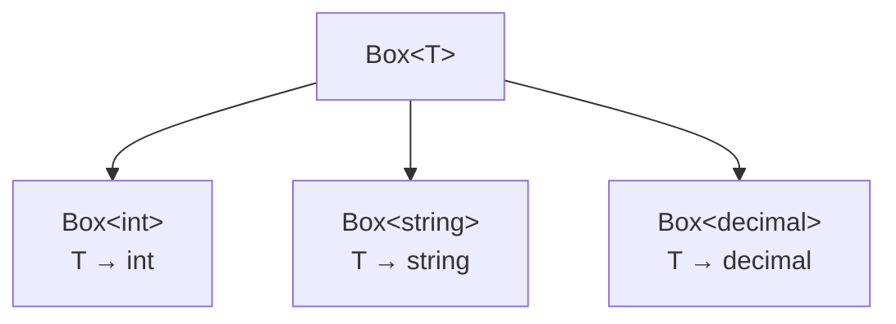

# Generics


## The Problem Generics Solve

Without generics, you either duplicate code for each type or use `object` and lose type safety:

```csharp
// Without generics -- type unsafe, boxing overhead
public class Box
{
    public object Value { get; set; }
}

var box = new Box { Value = 42 };
var number = (int)box.Value; // Must cast. Runtime error if wrong type.
```

Generics let you write type-safe, reusable code without duplication:

```csharp
public class Box<T>
{
    public T Value { get; set; }
}

var intBox = new Box<int> { Value = 42 };
var strBox = new Box<string> { Value = "hello" };

var number = intBox.Value; // No cast. Type is int.
```



## Generic Methods

```csharp
T Max<T>(T a, T b) where T : IComparable<T>
{
    return a.CompareTo(b) > 0 ? a : b;
}

Console.WriteLine(Max(3, 7));       // 7 -- inferred as int
Console.WriteLine(Max("a", "z"));   // z -- inferred as string
```

The `where T : IComparable<T>` constraint ensures `T` has a `CompareTo` method.

## Generic Classes

```csharp
public class Repository<T> where T : class, IEntity
{
    private readonly AppDbContext _db;

    public Repository(AppDbContext db) => _db = db;

    public async Task<T?> GetByIdAsync(int id) =>
        await _db.Set<T>().FindAsync(id);

    public async Task<List<T>> GetAllAsync() =>
        await _db.Set<T>().AsNoTracking().ToListAsync();

    public async Task AddAsync(T entity)
    {
        _db.Set<T>().Add(entity);
        await _db.SaveChangesAsync();
    }
}

public interface IEntity
{
    int Id { get; }
}
```

## Constraint Types

Constraints restrict what types can be used as generic arguments:

| Constraint | Meaning |
|-----------|---------|
| `where T : class` | T must be a reference type |
| `where T : struct` | T must be a value type |
| `where T : new()` | T must have a parameterless constructor |
| `where T : IEntity` | T must implement IEntity |
| `where T : BaseClass` | T must inherit BaseClass |
| `where T : notnull` | T must be a non-nullable type |

```csharp
// Multiple constraints
public class Service<T> where T : class, IEntity, new()
{
    public T CreateNew() => new T(); // Can call new() because of constraint
    public int GetId(T entity) => entity.Id; // Can access Id because of IEntity
}
```

## Built-in Generic Types You Use Daily

Every C# developer uses generics constantly through the standard library:

```csharp
// Collections
List<int> numbers = [1, 2, 3];
Dictionary<string, User> usersByEmail = new();
HashSet<int> ids = [1, 2, 3];

// Task<T> -- async return type
Task<User> userTask = GetUserAsync(42);

// Nullable<T> -- nullable value types
int? maybeNull = null;

// Func<T, TResult> -- generic delegate
Func<int, int, int> add = (a, b) => a + b;

// Action<T> -- generic delegate with no return
Action<string> log = message => Console.WriteLine(message);
```

## Why Generics Matter for Backend

Generics are the foundation of LINQ, EF Core, and dependency injection in ASP.NET Core:

```csharp
// LINQ -- generic extension methods on IEnumerable<T>
products.Where(p => p.Price > 100).Select(p => p.Name).ToList();

// EF Core -- generic DbSet<T>
public DbSet<User> Users => Set<User>();

// DI -- generic service registration
builder.Services.AddScoped<IOrderService, OrderService>();

// Options pattern -- generic configuration
builder.Services.Configure<JwtSettings>(builder.Configuration.GetSection("Jwt"));
```

Without generics, none of these would be type-safe. You would cast everywhere or write duplicate code for each entity type.
