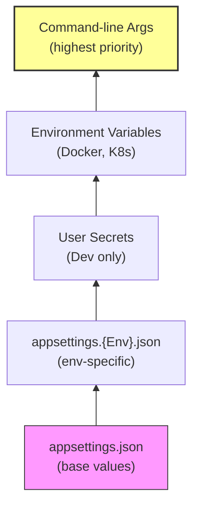

# Configuration and the Options Pattern

> **Concept:** See [Configuration](https://github.com/TP-Coder-Innovation-Hub/learning-content/blob/main/production-readiness/03-configuration.md) for the why and what of externalized configuration (12-factor app, env vars, secrets). This page covers the .NET implementation.

## IConfiguration

ASP.NET Core loads configuration from multiple sources in a layered order. Later sources override earlier ones:



## Strongly-Typed Configuration: IOptions<T>

Don't scatter magic strings like `Configuration["Jwt:Key"]` throughout your code. Bind configuration sections to C# records:

```csharp
public record JwtSettings
{
    public string Issuer { get; init; } = "";
    public string Audience { get; init; } = "";
    public string Key { get; init; } = "";
    public int ExpiryMinutes { get; init; } = 15;
}
```

### appsettings.json

```json
{
  "Jwt": {
    "Issuer": "https://api.example.com",
    "Audience": "my-app",
    "Key": "super-secret-key-change-in-production",
    "ExpiryMinutes": 30
  }
}
```

### Register and Inject

```csharp
var builder = WebApplication.CreateBuilder(args);

builder.Services.Configure<JwtSettings>(builder.Configuration.GetSection("Jwt"));

var app = builder.Build();
```

```csharp
public class TokenService(IOptions<JwtSettings> jwtSettings)
{
    private readonly JwtSettings _jwt = jwtSettings.Value;

    public string GenerateToken(User user)
    {
        var token = new JwtSecurityToken(
            issuer: _jwt.Issuer,
            audience: _jwt.Audience,
            // ...
            expires: DateTime.UtcNow.AddMinutes(_jwt.ExpiryMinutes));
        return new JwtSecurityTokenHandler().WriteToken(token);
    }
}
```

## Service Lifetime: Which IOptions to Use

| Interface | Lifetime | When to Use |
|---|---|---|
| `IOptions<T>` | Singleton | Static config that never changes after startup |
| `IOptionsSnapshot<T>` | Scoped | Per-request config when `appsettings.json` can change at runtime |
| `IOptionsMonitor<T>` | Singleton | Real-time config updates in a singleton service (push notifications on change) |

For most cases, use `IOptions<T>`. Use `IOptionsSnapshot<T>` when you hot-reload configuration files in production.

```csharp
// Scoped service (per-request)
public class OrderService(IOptionsSnapshot<RateLimitSettings> settings)
{
    private readonly RateLimitSettings _settings = settings.Value;
}

// Singleton with change notifications
public class CacheManager(IOptionsMonitor<CacheSettings> monitor) : ICacheManager
{
    public CacheManager()
    {
        monitor.OnChange(settings =>
        {
            RebuildCache(settings);
        });
    }
}
```

## Validated Options

Fail fast at startup if configuration is invalid. Don't discover a missing API key at runtime.

### Step 1: Add Validation Attributes

```csharp
using System.ComponentModel.DataAnnotations;

public record JwtSettings
{
    [Required]
    [MinLength(32)]
    public string Key { get; init; } = "";

    [Required]
    public string Issuer { get; init; } = "";

    [Range(1, 1440)]
    public int ExpiryMinutes { get; init; } = 15;
}
```

### Step 2: Register with Validation

```csharp
builder.Services.AddOptions<JwtSettings>()
    .Bind(builder.Configuration.GetSection("Jwt"))
    .ValidateDataAnnotations()       // Run [Required], [Range], etc.
    .ValidateOnStart();              // Fail fast at startup
```

If the key is missing or too short, the application crashes immediately with a clear error instead of starting with invalid config.

## Environment Variable Override

Environment variables override `appsettings.json`. This is how you configure the same Docker image for dev, staging, and production.

```bash
# Double underscore maps to JSON hierarchy
Jwt__Key=production-secret-key-at-least-32-chars
Jwt__ExpiryMinutes=60

# Run with env vars
Jwt__Key=prod-key dotnet run --environment Production
```

In Docker:

```dockerfile
ENV Jwt__Key=production-key
ENV Jwt__ExpiryMinutes=60
```

## Azure Key Vault for Secrets

Never store secrets in `appsettings.json`. Use Key Vault:

```bash
dotnet add package Azure.Extensions.AspNetCore.Configuration.Secrets
```

```csharp
if (!builder.Environment.IsDevelopment())
{
    builder.Configuration.AddAzureKeyVault(
        new Uri("https://myvault.vault.azure.net/"),
        new DefaultAzureCredential());
}
```

Key Vault secrets map to configuration keys: `Jwt--Key` in Key Vault becomes `Jwt:Key` in `IConfiguration`.
