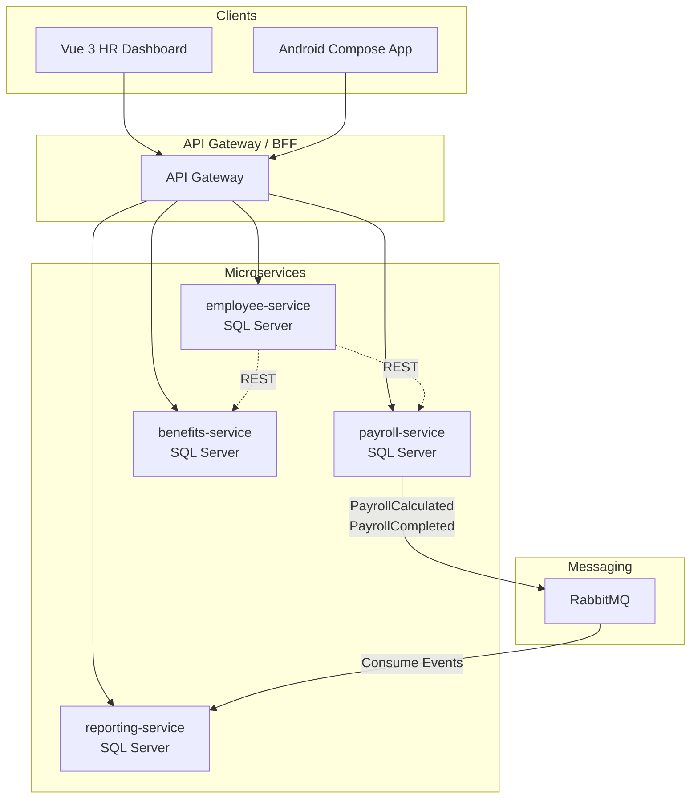
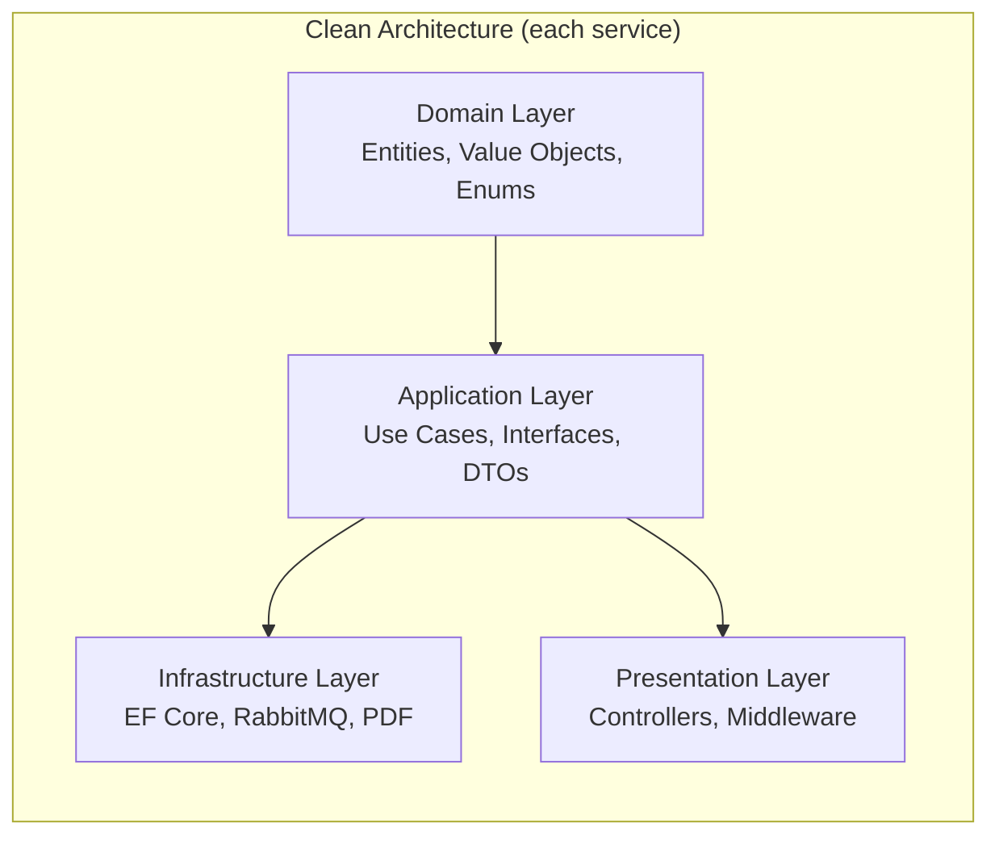

# Capstone: Payroll & Benefits Management System

> **Roadmap:** dotnet-csharp-backend
> **Challenge Repo:** https://github.com/TP-Coder-Innovation-Hub/payroll-and-benefits-management-challenge
> **Architecture:** 4 microservices | ASP.NET Core 8 | Clean Architecture

---

## 1. Business Context

Build a payroll and benefits management platform for mid-size Thai companies. The system handles employee records, monthly salary calculation with Thai progressive tax, social security deductions, provident fund contributions, benefit enrollment, leave tracking, and payslip/report generation.

HR admins use a Vue 3 dashboard. Employees access self-service features (payslips, leave balance, benefits) via an Android Jetpack Compose app.

---

## 2. Learning Objectives

- Design and implement 4 interdependent microservices using Clean Architecture
- Apply Thai payroll rules: progressive tax brackets, social security cap, provident fund matching
- Use EF Core with code-first migrations on SQL Server
- Implement async messaging with RabbitMQ (publish/subscribe)
- Secure APIs with JWT authentication and role-based authorization policies
- Generate PDF payslips and reports
- Containerize all services with Docker Compose
- Coordinate builds via CI pipeline from the challenge repo

---

## 3. Architecture





---

## 4. Services

### 4.1 employee-service

**Responsibility:** Employee CRUD, departments, salary grades.

| Feature | Acceptance Criteria |
|---------|-------------------|
| Create/update employee | POST/PUT returns employee with generated ID; validates Thai national ID format |
| List employees | GET with pagination, filtering by department/salary grade |
| Manage departments | CRUD for departments; each employee belongs to one department |
| Salary grades | Define grade bands (min/max salary); validation on assignment |
| Employee search | Search by name, employee code, department |

**Database:** SQL Server — tables: `Employees`, `Departments`, `SalaryGrades`

### 4.2 payroll-service

**Responsibility:** Salary calculation, Thai tax, deductions, payroll runs.

| Feature | Acceptance Criteria |
|---------|-------------------|
| Calculate monthly payroll | Computes gross, deductions, net from employee + salary grade |
| Thai progressive tax | Applies 2024 brackets: 0-150k (0%), 150k-300k (5%), 300k-500k (10%), 500k-750k (15%), 750k-1M (20%), 1M-2M (25%), 2M-5M (30%), 5M+ (35%) |
| Social security deduction | 5% of salary, capped at 750 THB/month (employer + employee each) |
| Provident fund | Employee contribution 2-15%, employer match configurable per policy |
| Scheduled payroll run | `IHostedService` triggers monthly run on configurable cron; publishes `PayrollCalculated` event per employee to RabbitMQ |
| Payroll history | Store monthly payroll records per employee; queryable by period |

**Database:** SQL Server — tables: `PayrollRecords`, `TaxBrackets`, `DeductionPolicies`, `PayrollRuns`

**Events published to RabbitMQ:**
- `payroll.calculated` — per employee, payload: employeeId, period, gross, deductions, net
- `payroll.run.completed` — per payroll run, payload: runId, period, totalEmployees, totalAmount

### 4.3 benefits-service

**Responsibility:** Benefit enrollment, leave tracking, balances.

| Feature | Acceptance Criteria |
|---------|-------------------|
| Enroll in benefits | Employee enrolls in health insurance plan and/or retirement fund; validates eligibility |
| Health insurance plans | CRUD for plans with coverage levels, premium rates |
| Leave request | Submit leave request (sick, personal, vacation); validates against balance |
| Leave balance | Track entitlement, used, remaining per leave type per year |
| Leave approval workflow | Manager approves/rejects; status transitions enforced |

**Database:** SQL Server — tables: `BenefitPlans`, `Enrollments`, `LeaveTypes`, `LeaveBalances`, `LeaveRequests`

### 4.4 reporting-service

**Responsibility:** Payslip PDF generation, payroll reports, tax reports.

| Feature | Acceptance Criteria |
|---------|-------------------|
| Generate payslip PDF | Consumes `payroll.calculated` event, generates PDF with salary breakdown, deductions, net pay; stores and exposes download endpoint |
| Monthly payroll summary report | Aggregated report per department: total gross, total deductions, total net |
| Annual tax report (PND1 style) | Yearly employee tax summary grouped by income bracket |
| Report history | List and download previously generated reports |

**Database:** SQL Server — tables: `Payslips`, `Reports`

**Events consumed from RabbitMQ:**
- `payroll.calculated` — trigger payslip generation
- `payroll.run.completed` — trigger summary report generation

---

## 5. Cross-Cutting Concerns

### 5.1 Authentication & Authorization

- JWT tokens issued by a shared auth endpoint (can live in employee-service or a separate identity service)
- Roles: `Admin`, `HR`, `Manager`, `Employee`
- Authorization policies:
  - `[Authorize(Roles = "Admin,HR")]` — employee management, payroll runs
  - `[Authorize(Roles = "Admin,HR,Manager")]` — leave approval
  - `[Authorize]` — employee self-service (own data only)

### 5.2 Inter-Service Communication

| Pattern | Usage | Protocol |
|---------|-------|----------|
| Synchronous | employee-service → payroll-service (salary data), employee-service → benefits-service (eligibility) | REST (HttpClient) |
| Asynchronous | payroll-service → reporting-service (payslip generation) | RabbitMQ (pub/sub) |

### 5.3 Thai Tax Calculation Rules

```
Taxable Income          Rate
0 - 150,000             0%
150,001 - 300,000       5%
300,001 - 500,000       10%
500,001 - 750,000       15%
750,001 - 1,000,000     20%
1,000,001 - 2,000,000   25%
2,000,001 - 5,000,000   30%
5,000,001+              35%
```

- Tax computed as sum of bracket portions (progressive, not flat)
- Social security: 5% employee contribution, capped at 750 THB/month
- Provident fund: employee 2-15%, employer match per company policy (default 3-5%)

---

## 6. Tech Constraints

| Constraint | Requirement |
|-----------|-------------|
| Framework | ASP.NET Core 8+ (LTS) |
| Architecture | Clean Architecture per service (Domain, Application, Infrastructure, Presentation) |
| ORM | Entity Framework Core with code-first migrations |
| Database | SQL Server (containerized) |
| Messaging | RabbitMQ via MassTransit or raw RabbitMQ client |
| Auth | JWT Bearer tokens, role-based policies |
| PDF | QuestPDF, iTextSharp, or equivalent for payslip generation |
| Containerization | Docker Compose for all services + dependencies |
| C# features | Records for DTOs, pattern matching, file-scoped namespaces |
| CI | Pipeline in challenge repo (build, test, lint on PR) |

---

## 7. Architecture Decision Records

### ADR-001: Clean Architecture per Service

**Context:** Each microservice needs clear separation between business logic and infrastructure.

**Decision:** Apply Clean Architecture with 4 layers per service: Domain (entities, enums), Application (use cases, interfaces), Infrastructure (EF Core, RabbitMQ, external APIs), Presentation (controllers, middleware).

**Consequence:** More files and projects per service, but testable business logic independent of frameworks. Dependency rule: outer layers depend on inner, never inward-out.

---

### ADR-002: RabbitMQ for Async Payroll Events

**Context:** Payroll calculation and payslip/report generation have different throughput and reliability needs.

**Decision:** Publish `payroll.calculated` and `payroll.run.completed` events to RabbitMQ. Reporting-service consumes asynchronously.

**Consequence:** Decouples payroll processing from report generation. Requires idempotent consumers and dead-letter handling. Adds RabbitMQ as infrastructure dependency.

---

### ADR-003: SQL Server per Service (Database-per-Service)

**Context:** Each service owns its data. No shared database.

**Decision:** Each microservice has its own SQL Server database (containerized separately or same server with separate schemas).

**Consequence:** Data consistency across services requires eventual consistency via events or REST calls. No cross-service JOINs. Simpler schema evolution per service.

---

### ADR-004: IHostedService for Scheduled Payroll Runs

**Context:** Payroll must run on a schedule (monthly, configurable date).

**Decision:** Use `IHostedService` with `BackgroundService` base class and a timer/cron expression. Trigger payroll calculation for all active employees.

**Consequence:** Simple in-process scheduling. For production, consider moving to Hangfire or Quartz for persistence and retry. Current approach suffices for capstone scope.

---

### ADR-005: REST for Sync Communication Between Services

**Context:** payroll-service and benefits-service need employee data from employee-service.

**Decision:** Use REST calls (via `IHttpClientFactory`). Each service exposes internal endpoints for service-to-service calls.

**Consequence:** Synchronous coupling — employee-service downtime blocks payroll. Acceptable for capstone scope. In production, consider caching or a service mesh.

---

## 8. Project Structure (per service)

```
src/
  EmployeeService/
    EmployeeService.Domain/       # Entities, Value Objects, Enums
    EmployeeService.Application/  # Use Cases, DTOs (records), Interfaces
    EmployeeService.Infrastructure/ # EF Core DbContext, Repositories, Migrations
    EmployeeService.Presentation/ # Controllers, Middleware, Program.cs
    EmployeeService.Tests/        # Unit + Integration tests
  PayrollService/                 # Same structure
  BenefitsService/                # Same structure
  ReportingService/               # Same structure
```

---

## 9. Frontend Scope

### Vue 3 HR Dashboard

- Employee management (CRUD, departments, salary grades)
- Trigger payroll runs (manual + view scheduled)
- Benefit plan management
- Leave approval
- View/download reports and payslips
- Tech: Vue 3 + Composition API + TypeScript + Vite + Pinia

### Android Jetpack Compose App

- Employee self-service
- View payslips (PDF download)
- Check leave balance, submit leave requests
- View enrolled benefits
- Tech: Jetpack Compose + MVVM + Retrofit + Hilt

---

## 10. Docker Compose Services

```yaml
services:
  employee-api:
  payroll-api:
  benefits-api:
  reporting-api:
  sqlserver:
  rabbitmq:
  employee-db:
  payroll-db:
  benefits-db:
  reporting-db:
```

---

## 11. Submission Checklist

- [ ] All 4 microservices compile and run via `docker compose up`
- [ ] EF Core migrations applied; databases seed with sample data
- [ ] Employee CRUD works end-to-end via Swagger/Postman
- [ ] Payroll calculation uses correct Thai progressive tax brackets
- [ ] Social security deduction capped at 750 THB
- [ ] Provident fund calculation configurable
- [ ] RabbitMQ publishes payroll events; reporting-service consumes them
- [ ] Payslip PDF generated with full salary breakdown
- [ ] JWT auth protects all endpoints; roles enforced
- [ ] Background service triggers scheduled payroll run
- [ ] Clean Architecture structure visible in each service
- [ ] Unit tests for tax calculation, deduction logic, leave balance
- [ ] Integration tests for API endpoints
- [ ] CI pipeline passes (build, test, lint)
- [ ] README with setup instructions, architecture diagram, and ADRs
- [ ] Code pushed to challenge repo with meaningful commit history
