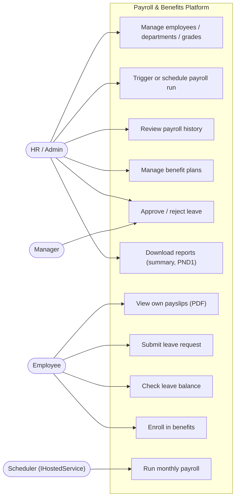
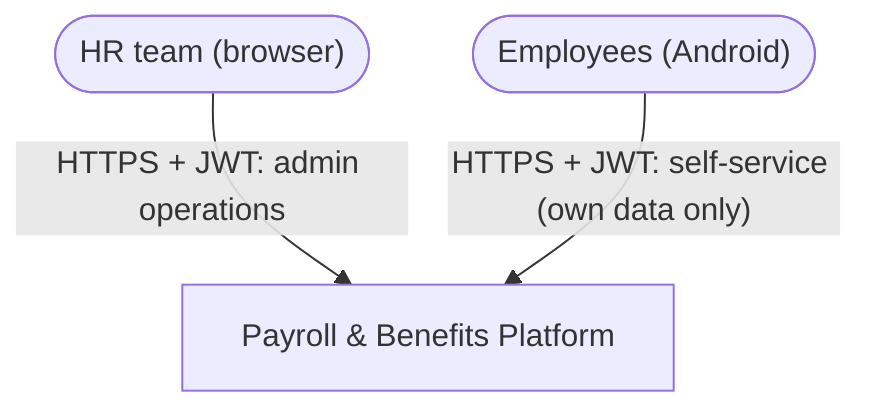
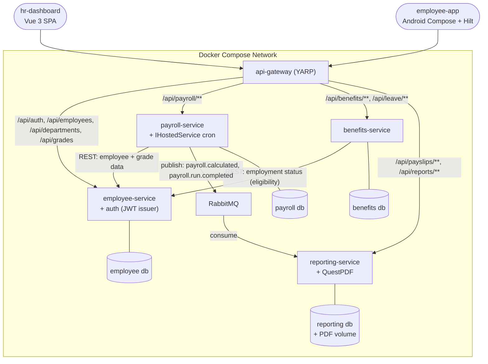
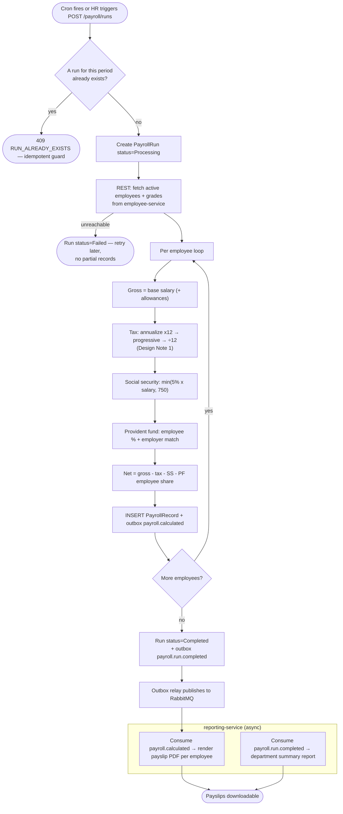
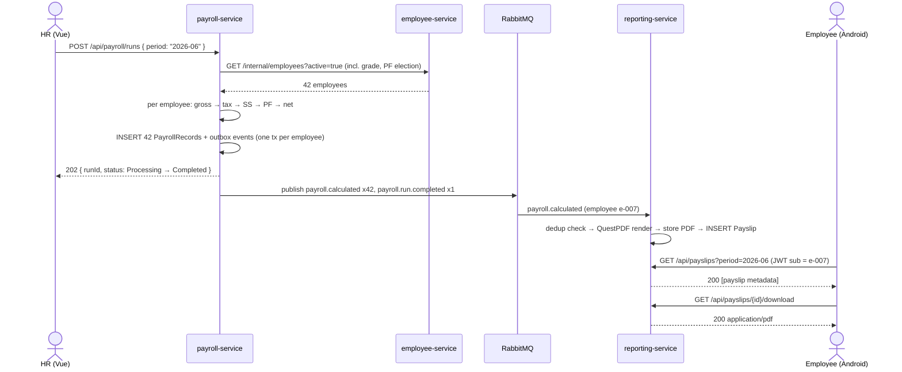
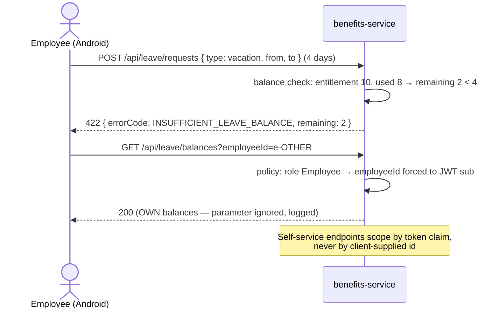

# Capstone Design: Payroll & Benefits Management System

> Companion to [01-capstone-spec.md](./01-capstone-spec.md). Diagrams, contracts, schemas. The spec already fixes the Clean Architecture project layout (§8) — follow it; everything inside the layers is yours.

## Design Notes (read first)

1. **The tax brackets are ANNUAL — monthly withholding must annualize.** The §5.3 brackets (0–150k @ 0% …) are yearly taxable-income bands. Monthly payroll computes: annualized income = monthly salary × 12 → progressive annual tax → **monthly withholding = annual tax ÷ 12**. Applying the brackets directly to a monthly salary is the classic mistake — your unit tests must catch it. Worked example (seed data uses it): salary 50,000 THB/month → annual 600,000 → tax = 0 + (150,000 × 5%) + (200,000 × 10%) + (100,000 × 15%) = 7,500 + 20,000 + 15,000 = **42,500/year → 3,541.67/month**. (Real PND1 also deducts allowances/expenses before taxing — out of scope; state that in your README.)
2. **Identity lives in employee-service.** The spec allows a shared auth endpoint "in employee-service or separate" — choose employee-service: employees *are* the users, and a fifth service buys nothing here. `POST /api/auth/login` issues JWTs (role claim); all services validate with the shared signing key.
3. **Leave approval needs a manager relationship.** The spec's `Manager` role approves leave but defines no reporting line. Design: `Employees.ManagerId` self-reference; a Manager may approve only their direct reports' requests (Admin/HR may approve any).
4. **The gateway is YARP.** One ASP.NET Core reverse-proxy project routing `/api/employees|payroll|benefits|reports` — route config, not business logic. JWT validation happens at each service (defense in depth), the gateway only forwards.
5. **Social security cap:** 5% of salary capped at **750 THB/month** (i.e., the contribution base caps at 15,000) — employee and employer each. Provident fund: employee 2–15% elected, employer match from `DeductionPolicies`.

---

## Part 1: High-Level Design

### 1.1 Use-Case Diagram



### 1.2 System Context Diagram



Self-contained: the bank-transfer and Revenue Department e-filing integrations a real payroll system needs are explicitly out of scope.

### 1.3 Container Diagram



### 1.4 Activity Diagram — Monthly Payroll Run (primary business process)



### 1.5 Sequence Diagrams

#### 1.5.1 Happy path — payroll run to downloadable payslip



#### 1.5.2 Error path — leave request exceeding balance; cross-employee access denied



#### 1.5.3 Async path — payslip consumer idempotency + DLQ

```mermaid
sequenceDiagram
    participant MQ as RabbitMQ
    participant RS as reporting-service
    participant DLQ as dead-letter queue

    MQ->>RS: payroll.calculated (messageId m-1, employee e-007)
    RS->>RS: INSERT ProcessedMessages m-1 (unique) → render PDF → ack
    MQ->>RS: payroll.calculated (m-1 REDELIVERED — ack lost)
    RS->>RS: unique violation → already processed → ack, no duplicate PDF
    MQ->>RS: payroll.calculated (m-2, malformed payload)
    RS->>RS: deserialization fails → retry x3 (MassTransit policy)
    RS->>DLQ: m-2 to payroll-events.dlq after retries
    Note over DLQ: HR-visible? No — ops concern. Monitor queue<br/>depth; replay tooling is a stretch goal.
```

---

## Part 2: Frontend Design

### 2.1 Frontend Justification

| Frontend | Actors | Why |
|---|---|---|
| Vue 3 HR dashboard | Admin, HR, Manager | Employee administration, payroll runs, plan management, leave approval — desktop, data-dense |
| Android Compose app | Employee | Self-service where employees actually are: payslip on payday, leave request from anywhere |

Role overlap note: Managers use the **web** dashboard (approval queue), and are also Employees in the Android app for their own self-service. Role comes from the JWT; both clients render by claim.

### 2.2 Route Map (Vue 3) and Screen Map (Android)

**Vue 3 — hr-dashboard**

| Route | Name | Purpose |
|---|---|---|
| `/login` | Login | JWT login |
| `/` | Overview | Headcount, next scheduled run, pending leave count, last run status |
| `/employees` | EmployeeList | Paginated, search by name/code, filter dept/grade |
| `/employees/new`, `/employees/:id` | EmployeeForm/Detail | CRUD; Thai national ID validated (13-digit checksum); grade assignment validated against band |
| `/departments` | Departments | CRUD |
| `/grades` | SalaryGrades | Band definitions (min/max) |
| `/payroll/runs` | PayrollRuns | Run history + "Run payroll now"; schedule visibility |
| `/payroll/runs/:id` | RunDetail | Per-employee records, totals, status |
| `/benefits/plans` | BenefitPlans | CRUD plans (coverage, premium) |
| `/leave/approvals` | LeaveApprovals | Pending queue (Manager: own reports; HR: all); approve/reject with note |
| `/reports` | Reports | Monthly summaries + annual PND1-style; download |
| `/:pathMatch(.*)*` | NotFound | 404 |

Router guards by role claim: `/payroll`, `/employees` mutations → Admin/HR; `/leave/approvals` → Admin/HR/Manager.

**Android — employee-app (Compose + MVVM + Hilt + Retrofit)**

| Screen | Purpose |
|---|---|
| `LoginScreen` | Employee code/email + password |
| `HomeScreen` | Latest payslip card, leave balance summary, pending request status |
| `PayslipListScreen` / PDF viewer | Per-period payslips; download/open PDF (scoped storage) |
| `LeaveBalanceScreen` | Per-type entitlement/used/remaining for current year |
| `LeaveRequestScreen` | Type + date range + reason; client-side balance hint, server authoritative |
| `BenefitsScreen` | Enrolled plans; enroll flow with eligibility errors surfaced |

### 2.3 Key UI Interactions

| Interaction | Behavior |
|---|---|
| Payroll run trigger | Confirmation dialog shows period + active-employee count; 202 → poll run status until Completed/Failed; 409 RUN_ALREADY_EXISTS → link to the existing run |
| Payslip math display | Payslip detail (both clients) itemizes gross → tax → SS → PF → net; the Android card shows net prominently. Numbers must reconcile with the worked example in Design Note 1 |
| Leave approval queue | Approve/reject inline; optimistic row removal with rollback on failure; Manager sees only direct reports (server-enforced) |
| Leave request validation | 422 INSUFFICIENT_LEAVE_BALANCE shows remaining days inline; date-range picker blocks past dates client-side |
| PDF handling | Vue: open in new tab (`Content-Disposition: inline`); Android: download + open via FileProvider |
| Own-data scoping | Android never sends `employeeId` — server derives from JWT `sub` (see 1.5.2) |

---

## Part 3: API Contracts

All via gateway, `Authorization: Bearer <JWT>`; claims: `sub` (employeeId), `role`. Errors: `{ "status": 422, "errorCode": "INSUFFICIENT_LEAVE_BALANCE", "message": "...", "details": {} }`. Money: THB string decimal, 2 dp.

### employee-service

| | |
|---|---|
| `POST /api/auth/login` — `{ "email", "password" }` | 200 `{ "accessToken", "expiresIn", "role", "employeeId" }` · 401 |
| `GET /api/employees?search=&departmentId=&gradeId=&page=1&size=20` (Admin/HR) | 200 paginated `Employee` |
| `POST /api/employees` (Admin/HR) — `{ "employeeCode", "firstName", "lastName", "nationalId", "email", "departmentId", "gradeId", "baseSalary", "managerId", "pfEmployeePercent", "hiredAt" }` | 201 `Employee` · 422 (invalid 13-digit Thai national ID checksum; salary outside grade band) · 409 duplicate code/email |
| `GET /api/employees/{id}` (Admin/HR, or self) | 200 `Employee` · 403 (employee reading others) · 404 |
| `PUT /api/employees/{id}` (Admin/HR) | 200 · 422, 404 |
| `GET/POST/PUT/DELETE /api/departments[/{id}]` (Admin/HR) | standard CRUD; DELETE → 409 DEPARTMENT_NOT_EMPTY |
| `GET/POST/PUT /api/grades[/{id}]` (Admin/HR) | CRUD; `{ "name", "minSalary", "maxSalary" }`, 422 min>max |
| `GET /internal/employees?active=true` (service-to-service token) | active employees with grade + PF election — payroll's input |

### payroll-service

| | |
|---|---|
| `POST /api/payroll/runs` — `{ "period": "2026-06" }` (Admin/HR) | 202 `{ "runId", "period", "status": "Processing" }` · 409 RUN_ALREADY_EXISTS · 503 EMPLOYEE_SERVICE_DOWN |
| `GET /api/payroll/runs?page=&size=` (Admin/HR) | 200 runs `{ "runId", "period", "status": "Processing" \| "Completed" \| "Failed", "totalEmployees", "totalGross", "totalNet", "startedAt", "completedAt" }` |
| `GET /api/payroll/runs/{id}` (Admin/HR) | 200 run + records |
| `GET /api/payroll/records?employeeId=&period=&page=&size=` (Admin/HR; self with forced own id) | 200 `PayrollRecord`: `{ "id", "employeeId", "period", "gross", "taxWithheld", "socialSecurity", "pfEmployee", "pfEmployer", "net", "calculatedAt" }` |
| `GET /api/payroll/policies` / `PUT` (Admin) | deduction policy: `{ "pfEmployerMatchPercent": 5.0, "ssRatePercent": 5.0, "ssMonthlyCap": "750.00" }` |

### benefits-service

| | |
|---|---|
| `GET /api/benefits/plans` (any) / `POST/PUT` (Admin/HR) | plans `{ "id", "name", "type": "health" \| "retirement", "coverageLevel", "monthlyPremium" }` |
| `POST /api/benefits/enrollments` — `{ "planId" }` (Employee, self) | 201 enrollment · 422 NOT_ELIGIBLE (probation: < 120 days since hire — eligibility check calls employee-service) · 409 ALREADY_ENROLLED |
| `GET /api/benefits/enrollments` (self; Admin/HR with `employeeId=`) | 200 enrollments |
| `GET /api/leave/types` | 200 `{ "id", "name": "sick" \| "personal" \| "vacation", "annualEntitlementDays" }` |
| `GET /api/leave/balances?year=2026` (self; Admin/HR/Manager scoped) | 200 `[ { "leaveType", "entitlement", "used", "remaining" } ]` |
| `POST /api/leave/requests` — `{ "leaveTypeId", "fromDate", "toDate", "reason" }` (self) | 201 request `Pending` · 422 INSUFFICIENT_LEAVE_BALANCE \| INVALID_DATE_RANGE |
| `GET /api/leave/requests?status=Pending` (Manager: direct reports; Admin/HR: all) | 200 paginated requests |
| `PATCH /api/leave/requests/{id}` — `{ "status": "Approved" \| "Rejected", "note" }` (Manager/HR/Admin) | 200 (Approved decrements balance atomically) · 403 NOT_YOUR_REPORT · 409 ALREADY_DECIDED |

### reporting-service

| | |
|---|---|
| `GET /api/payslips?period=&page=&size=` (self; Admin/HR with `employeeId=`) | 200 `{ "id", "employeeId", "period", "net", "generatedAt" }` |
| `GET /api/payslips/{id}/download` (owner or Admin/HR) | 200 `application/pdf` · 403, 404 |
| `GET /api/reports?type=monthly_summary\|annual_tax&period=` (Admin/HR) | 200 report metadata list |
| `GET /api/reports/{id}/download` (Admin/HR) | 200 `application/pdf` |

---

## Part 4: Database Schema

SQL Server T-SQL; EF Core code-first should converge on these (table names match the spec §4).

### employee db

```sql
CREATE TABLE Departments (
    Id   UNIQUEIDENTIFIER NOT NULL PRIMARY KEY DEFAULT NEWSEQUENTIALID(),
    Name NVARCHAR(64) NOT NULL UNIQUE
);

CREATE TABLE SalaryGrades (
    Id        UNIQUEIDENTIFIER NOT NULL PRIMARY KEY DEFAULT NEWSEQUENTIALID(),
    Name      NVARCHAR(32) NOT NULL UNIQUE,
    MinSalary DECIMAL(12,2) NOT NULL,
    MaxSalary DECIMAL(12,2) NOT NULL,
    CHECK (MaxSalary >= MinSalary)
);

CREATE TABLE Employees (
    Id                UNIQUEIDENTIFIER NOT NULL PRIMARY KEY DEFAULT NEWSEQUENTIALID(),
    EmployeeCode      NVARCHAR(16)  NOT NULL UNIQUE,
    FirstName         NVARCHAR(64)  NOT NULL,
    LastName          NVARCHAR(64)  NOT NULL,
    NationalId        CHAR(13)      NOT NULL UNIQUE,  -- Thai ID; checksum validated in Domain layer
    Email             NVARCHAR(255) NOT NULL UNIQUE,
    PasswordHash      NVARCHAR(255) NOT NULL,         -- identity lives here (Design Note 2)
    Role              NVARCHAR(16)  NOT NULL DEFAULT 'Employee'
                      CHECK (Role IN ('Admin','HR','Manager','Employee')),
    DepartmentId      UNIQUEIDENTIFIER NOT NULL REFERENCES Departments(Id),
    GradeId           UNIQUEIDENTIFIER NOT NULL REFERENCES SalaryGrades(Id),
    BaseSalary        DECIMAL(12,2) NOT NULL,         -- must fall in grade band (Application layer)
    ManagerId         UNIQUEIDENTIFIER NULL REFERENCES Employees(Id),  -- reporting line (Design Note 3)
    PfEmployeePercent DECIMAL(4,2) NOT NULL DEFAULT 5.00 CHECK (PfEmployeePercent BETWEEN 2 AND 15),
    Active            BIT NOT NULL DEFAULT 1,
    HiredAt           DATE NOT NULL,
    CreatedAt         DATETIME2 NOT NULL DEFAULT SYSUTCDATETIME()
);
CREATE INDEX IX_Employees_Dept ON Employees (DepartmentId);
CREATE INDEX IX_Employees_Manager ON Employees (ManagerId);
```

### payroll db

```sql
CREATE TABLE TaxBrackets (              -- seeded with the 2024 table; year-versioned
    Id        INT IDENTITY PRIMARY KEY,
    TaxYear   INT NOT NULL,
    LowerBound DECIMAL(14,2) NOT NULL,  -- annual taxable income
    UpperBound DECIMAL(14,2) NULL,      -- NULL = top bracket
    RatePercent DECIMAL(5,2) NOT NULL
);

CREATE TABLE DeductionPolicies (
    Id                     INT IDENTITY PRIMARY KEY,
    PfEmployerMatchPercent DECIMAL(4,2) NOT NULL DEFAULT 5.00,
    SsRatePercent          DECIMAL(4,2) NOT NULL DEFAULT 5.00,
    SsMonthlyCap           DECIMAL(8,2) NOT NULL DEFAULT 750.00,
    EffectiveFrom          DATE NOT NULL
);

CREATE TABLE PayrollRuns (
    Id             UNIQUEIDENTIFIER NOT NULL PRIMARY KEY DEFAULT NEWSEQUENTIALID(),
    Period         CHAR(7) NOT NULL UNIQUE,   -- 'YYYY-MM'; the idempotency guard for runs
    Status         NVARCHAR(16) NOT NULL CHECK (Status IN ('Processing','Completed','Failed')),
    TotalEmployees INT NOT NULL DEFAULT 0,
    TotalGross     DECIMAL(16,2) NOT NULL DEFAULT 0,
    TotalNet       DECIMAL(16,2) NOT NULL DEFAULT 0,
    StartedAt      DATETIME2 NOT NULL DEFAULT SYSUTCDATETIME(),
    CompletedAt    DATETIME2 NULL
);

CREATE TABLE PayrollRecords (
    Id             UNIQUEIDENTIFIER NOT NULL PRIMARY KEY DEFAULT NEWSEQUENTIALID(),
    RunId          UNIQUEIDENTIFIER NOT NULL REFERENCES PayrollRuns(Id),
    EmployeeId     UNIQUEIDENTIFIER NOT NULL,   -- employee-service id; no cross-DB FK
    Period         CHAR(7) NOT NULL,
    Gross          DECIMAL(12,2) NOT NULL,
    TaxWithheld    DECIMAL(12,2) NOT NULL,
    SocialSecurity DECIMAL(8,2)  NOT NULL,      -- <= policy cap
    PfEmployee     DECIMAL(12,2) NOT NULL,
    PfEmployer     DECIMAL(12,2) NOT NULL,      -- informational, not deducted from net
    Net            DECIMAL(12,2) NOT NULL,
    CalculatedAt   DATETIME2 NOT NULL DEFAULT SYSUTCDATETIME(),
    CONSTRAINT UQ_Record_EmployeePeriod UNIQUE (EmployeeId, Period)  -- re-run safety net
);
CREATE INDEX IX_Records_Period ON PayrollRecords (Period);

CREATE TABLE OutboxMessages (           -- event published atomically with the record
    Id          UNIQUEIDENTIFIER NOT NULL PRIMARY KEY DEFAULT NEWID(),
    AggregateId UNIQUEIDENTIFIER NOT NULL,
    EventType   NVARCHAR(64) NOT NULL,
    Payload     NVARCHAR(MAX) NOT NULL,
    Published   BIT NOT NULL DEFAULT 0,
    CreatedAt   DATETIME2 NOT NULL DEFAULT SYSUTCDATETIME()
);
CREATE INDEX IX_Outbox_Unpublished ON OutboxMessages (CreatedAt) WHERE Published = 0;
```

### benefits db

```sql
CREATE TABLE BenefitPlans (
    Id             UNIQUEIDENTIFIER NOT NULL PRIMARY KEY DEFAULT NEWSEQUENTIALID(),
    Name           NVARCHAR(128) NOT NULL,
    PlanType       NVARCHAR(16)  NOT NULL CHECK (PlanType IN ('health','retirement')),
    CoverageLevel  NVARCHAR(32)  NOT NULL,        -- e.g. 'basic','premium','family'
    MonthlyPremium DECIMAL(10,2) NOT NULL,
    Active         BIT NOT NULL DEFAULT 1
);

CREATE TABLE Enrollments (
    Id         UNIQUEIDENTIFIER NOT NULL PRIMARY KEY DEFAULT NEWSEQUENTIALID(),
    EmployeeId UNIQUEIDENTIFIER NOT NULL,
    PlanId     UNIQUEIDENTIFIER NOT NULL REFERENCES BenefitPlans(Id),
    EnrolledAt DATETIME2 NOT NULL DEFAULT SYSUTCDATETIME(),
    CONSTRAINT UQ_Enroll UNIQUE (EmployeeId, PlanId)
);

CREATE TABLE LeaveTypes (
    Id                    INT IDENTITY PRIMARY KEY,
    Name                  NVARCHAR(16) NOT NULL UNIQUE CHECK (Name IN ('sick','personal','vacation')),
    AnnualEntitlementDays INT NOT NULL
);

CREATE TABLE LeaveBalances (
    Id          UNIQUEIDENTIFIER NOT NULL PRIMARY KEY DEFAULT NEWSEQUENTIALID(),
    EmployeeId  UNIQUEIDENTIFIER NOT NULL,
    LeaveTypeId INT NOT NULL REFERENCES LeaveTypes(Id),
    LeaveYear   INT NOT NULL,
    Entitlement INT NOT NULL,
    UsedDays    INT NOT NULL DEFAULT 0 CHECK (UsedDays >= 0),
    CONSTRAINT UQ_Balance UNIQUE (EmployeeId, LeaveTypeId, LeaveYear),
    CHECK (UsedDays <= Entitlement)     -- the balance invariant, DB-enforced
);

CREATE TABLE LeaveRequests (
    Id          UNIQUEIDENTIFIER NOT NULL PRIMARY KEY DEFAULT NEWSEQUENTIALID(),
    EmployeeId  UNIQUEIDENTIFIER NOT NULL,
    LeaveTypeId INT NOT NULL REFERENCES LeaveTypes(Id),
    FromDate    DATE NOT NULL,
    ToDate      DATE NOT NULL,
    DaysCount   INT NOT NULL,
    Reason      NVARCHAR(500),
    Status      NVARCHAR(12) NOT NULL DEFAULT 'Pending' CHECK (Status IN ('Pending','Approved','Rejected')),
    DecidedBy   UNIQUEIDENTIFIER NULL,
    DecisionNote NVARCHAR(500),
    CreatedAt   DATETIME2 NOT NULL DEFAULT SYSUTCDATETIME(),
    DecidedAt   DATETIME2 NULL,
    CHECK (ToDate >= FromDate)
);
CREATE INDEX IX_Requests_Pending ON LeaveRequests (Status, CreatedAt) WHERE Status = 'Pending';
```

### reporting db

```sql
CREATE TABLE ProcessedMessages (        -- consumer idempotency
    MessageId   UNIQUEIDENTIFIER NOT NULL PRIMARY KEY,
    ProcessedAt DATETIME2 NOT NULL DEFAULT SYSUTCDATETIME()
);

CREATE TABLE Payslips (
    Id          UNIQUEIDENTIFIER NOT NULL PRIMARY KEY DEFAULT NEWSEQUENTIALID(),
    EmployeeId  UNIQUEIDENTIFIER NOT NULL,
    Period      CHAR(7) NOT NULL,
    Net         DECIMAL(12,2) NOT NULL,
    FilePath    NVARCHAR(512) NOT NULL,  -- volume path (S3 key in production)
    GeneratedAt DATETIME2 NOT NULL DEFAULT SYSUTCDATETIME(),
    CONSTRAINT UQ_Payslip UNIQUE (EmployeeId, Period)
);

CREATE TABLE Reports (
    Id          UNIQUEIDENTIFIER NOT NULL PRIMARY KEY DEFAULT NEWSEQUENTIALID(),
    ReportType  NVARCHAR(32) NOT NULL CHECK (ReportType IN ('monthly_summary','annual_tax')),
    Period      NVARCHAR(7) NOT NULL,    -- 'YYYY-MM' or 'YYYY'
    FilePath    NVARCHAR(512) NOT NULL,
    GeneratedAt DATETIME2 NOT NULL DEFAULT SYSUTCDATETIME()
);
```

---

## Part 5: Event Contracts (RabbitMQ)

Topology: topic exchange **`payroll-events`** · queue `reporting-payslips` bound to `payroll.calculated` · queue `reporting-summaries` bound to `payroll.run.completed` · DLX `payroll-events.dlx` with queue `payroll-events.dlq` (after 3 retries). With MassTransit, let convention create equivalents — but understand the underlying topology either way.

Envelope: `{ "messageId": uuid, "eventType": string, "occurredAt": iso8601, "payload": {} }` · Delivery: at-least-once (publisher outbox, consumer `ProcessedMessages` dedup).

| Routing key | Producer → Consumer | Payload |
|---|---|---|
| `payroll.calculated` | payroll-service → reporting-service | `{ "employeeId": uuid, "employeeName": string, "departmentName": string, "period": "2026-06", "gross": "50000.00", "taxWithheld": "3541.67", "socialSecurity": "750.00", "pfEmployee": "2500.00", "pfEmployer": "2500.00", "net": "43208.33" }` |
| `payroll.run.completed` | payroll-service → reporting-service | `{ "runId": uuid, "period": "2026-06", "totalEmployees": 42, "totalGross": "2150000.00", "totalNet": "1843000.00" }` |

Payloads are deliberately self-contained (names, department included) — reporting must render payslips without calling employee-service. That denormalization is the event-design lesson; mention it in your ADRs.

---

## Part 6: Seed Data

```sql
-- employee db: departments, grades, then employees forming a manager chain
INSERT INTO Departments (Id, Name) VALUES
('D1...0001', N'Engineering'), ('D1...0002', N'Finance'), ('D1...0003', N'People');

INSERT INTO SalaryGrades (Id, Name, MinSalary, MaxSalary) VALUES
('G1...0001', N'G1', 18000, 35000), ('G1...0002', N'G2', 35000, 70000), ('G1...0003', N'G3', 70000, 150000);

-- Password for all: "Passw0rd!" (hash at seed). National IDs must pass the mod-11 checksum.
INSERT INTO Employees (Id, EmployeeCode, FirstName, LastName, NationalId, Email, PasswordHash, Role,
                       DepartmentId, GradeId, BaseSalary, ManagerId, PfEmployeePercent, HiredAt) VALUES
('E1...0001', N'TP-001', N'Apinya',  N'Srisuwan', '<valid-id-1>', N'apinya@tpcoder.test',  '<hash>', N'Admin',
 'D1...0003', 'G1...0003', 95000.00, NULL,        5.00, '2022-01-10'),
('E1...0002', N'TP-002', N'Nok',     N'Chaiyo',   '<valid-id-2>', N'nok@tpcoder.test',     '<hash>', N'HR',
 'D1...0003', 'G1...0002', 48000.00, 'E1...0001', 3.00, '2023-03-01'),
('E1...0003', N'TP-003', N'Somchai', N'Jaidee',   '<valid-id-3>', N'somchai@tpcoder.test', '<hash>', N'Manager',
 'D1...0001', 'G1...0003', 85000.00, 'E1...0001', 10.00, '2021-06-15'),
('E1...0004', N'TP-004', N'Malee',   N'Suksai',   '<valid-id-4>', N'malee@tpcoder.test',   '<hash>', N'Employee',
 'D1...0001', 'G1...0002', 50000.00, 'E1...0003', 5.00, '2024-02-01'),   -- Design Note 1's worked example
('E1...0005', N'TP-005', N'Prasert', N'Boonmee',  '<valid-id-5>', N'prasert@tpcoder.test', '<hash>', N'Employee',
 'D1...0001', 'G1...0001', 14000.00, 'E1...0003', 2.00, DATEADD(day, -60, CAST(GETDATE() AS date)));
-- Prasert: salary 14,000 → SS = 700 (under cap, proves the min() not a constant);
-- hired 60 days ago → benefits enrollment must 422 NOT_ELIGIBLE (probation < 120 days).

-- payroll db
INSERT INTO TaxBrackets (TaxYear, LowerBound, UpperBound, RatePercent) VALUES
(2024, 0, 150000, 0),(2024, 150000, 300000, 5),(2024, 300000, 500000, 10),
(2024, 500000, 750000, 15),(2024, 750000, 1000000, 20),(2024, 1000000, 2000000, 25),
(2024, 2000000, 5000000, 30),(2024, 5000000, NULL, 35);

INSERT INTO DeductionPolicies (PfEmployerMatchPercent, SsRatePercent, SsMonthlyCap, EffectiveFrom)
VALUES (5.00, 5.00, 750.00, '2024-01-01');

INSERT INTO PayrollRuns (Id, Period, Status, TotalEmployees, TotalGross, TotalNet, StartedAt, CompletedAt) VALUES
('R1...0001', '2026-05', N'Completed', 3, 149000.00, 122278.33, '2026-06-01 00:05:00', '2026-06-01 00:05:12');

INSERT INTO PayrollRecords (Id, RunId, EmployeeId, Period, Gross, TaxWithheld, SocialSecurity, PfEmployee, PfEmployer, Net) VALUES
('PR...0001', 'R1...0001', 'E1...0003', '2026-05', 85000.00, 9625.00, 750.00, 8500.00, 8500.00, 66125.00),
('PR...0002', 'R1...0001', 'E1...0004', '2026-05', 50000.00, 3541.67, 750.00, 2500.00, 2500.00, 43208.33),
('PR...0003', 'R1...0001', 'E1...0005', '2026-05', 14000.00, 75.00,   700.00, 280.00,  280.00,  12945.00);

-- benefits db
INSERT INTO LeaveTypes (Name, AnnualEntitlementDays) VALUES (N'sick', 30), (N'personal', 6), (N'vacation', 10);

INSERT INTO BenefitPlans (Id, Name, PlanType, CoverageLevel, MonthlyPremium) VALUES
('B1...0001', N'Group Health — Basic',   N'health',     N'basic',   450.00),
('B1...0002', N'Group Health — Family',  N'health',     N'family',  1200.00),
('B1...0003', N'Retirement Fund Plus',   N'retirement', N'standard', 0.00);

-- Leave balances: 3 eligible employees x 3 types (year 2026)
-- Malee vacation: 8 of 10 used — the 422 INSUFFICIENT_LEAVE_BALANCE fixture
INSERT INTO LeaveBalances (Id, EmployeeId, LeaveTypeId, LeaveYear, Entitlement, UsedDays) VALUES
('LB...0101', 'E1...0003', 1, 2026, 30, 2),
('LB...0102', 'E1...0003', 2, 2026, 6,  1),
('LB...0103', 'E1...0003', 3, 2026, 10, 3),
('LB...0201', 'E1...0004', 1, 2026, 30, 5),
('LB...0202', 'E1...0004', 2, 2026, 6,  2),
('LB...0203', 'E1...0004', 3, 2026, 10, 8),
('LB...0301', 'E1...0005', 1, 2026, 30, 0),
('LB...0302', 'E1...0005', 2, 2026, 6,  0),
('LB...0303', 'E1...0005', 3, 2026, 10, 0);

-- Pending request from Malee (Somchai's approval queue fixture)
INSERT INTO LeaveRequests (Id, EmployeeId, LeaveTypeId, FromDate, ToDate, DaysCount, Reason, Status) VALUES
('LR...0001', 'E1...0004', 3, '2026-07-14', '2026-07-15', 2, N'Family trip', N'Pending');

-- Approved historical request (timeline rendering)
INSERT INTO LeaveRequests (Id, EmployeeId, LeaveTypeId, FromDate, ToDate, DaysCount, Reason, Status, DecidedBy, DecidedAt) VALUES
('LR...0002', 'E1...0004', 1, '2026-04-10', '2026-04-11', 2, N'Fever', N'Approved', 'E1...0003', '2026-04-09 16:30:00');

-- reporting db: payslips + monthly summary
INSERT INTO Payslips (Id, EmployeeId, Period, Net, FilePath) VALUES
('PS...0001', 'E1...0003', '2026-05', 66125.00, N'/payslips/2026-05/E1...0003.pdf'),
('PS...0002', 'E1...0004', '2026-05', 43208.33, N'/payslips/2026-05/E1...0004.pdf'),
('PS...0003', 'E1...0005', '2026-05', 12945.00, N'/payslips/2026-05/E1...0005.pdf');

INSERT INTO Reports (Id, ReportType, Period, FilePath) VALUES
('RP...0001', N'monthly_summary', N'2026-05', N'/reports/2026-05/summary.pdf');
```

| Seeded scenario | What it exercises |
|---|---|
| Malee 50k = the worked example | Tax unit test oracle; payslip math on both UIs |
| Prasert 14k salary | SS under-cap branch (700, not 750); lowest bracket tax |
| Prasert hired 60 days ago | Benefits eligibility 422 |
| Manager chain (Somchai → Malee/Prasert) | Manager-scoped approval queue; 403 NOT_YOUR_REPORT |
| Malee vacation 8/10 used + pending request | 422 on over-request; approval decrements atomically |
| Completed run for last month | Run history, payslip downloads, 409 on duplicate period |
| 4 roles across 5 users | Every authorization policy in §5.1 |
