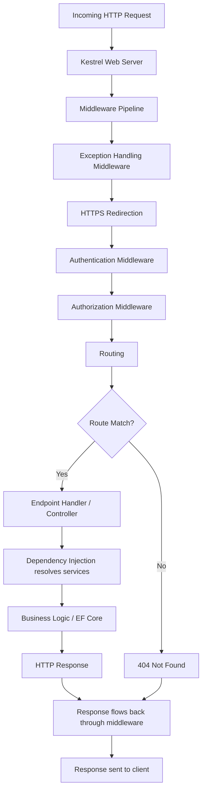
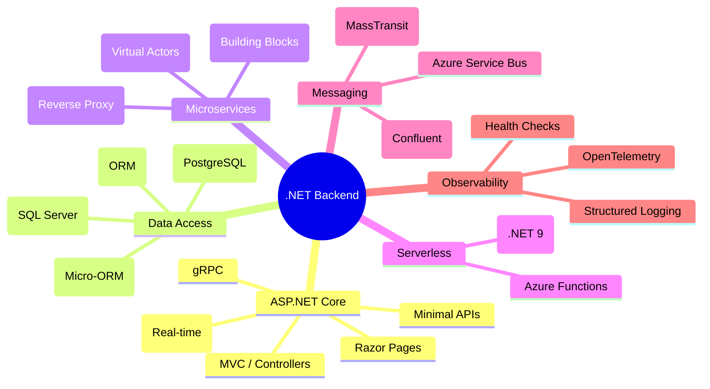
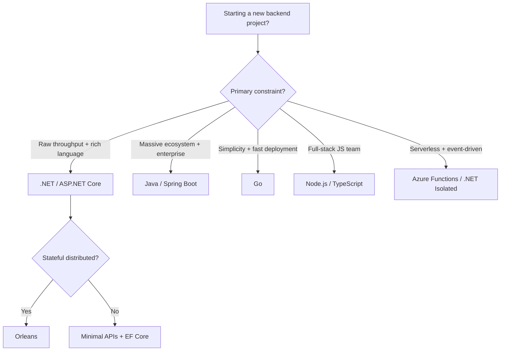

# .NET C# Backend Fundamentals

> A comprehensive guide to building production-grade backend systems with .NET 9/10 and C# 13.

`[Entry]` `[Mid]` `[Senior]`

---

## Table of Contents

1. [Why .NET for Backend in 2026](#1-why-net-for-backend-in-2026)
2. [The .NET Mental Model](#2-the-net-mental-model)
3. [C# for Backend: The Language](#3-c-for-backend-the-language)
4. [ASP.NET Core: The Pipeline](#4-aspnet-core-the-pipeline)
5. [Entity Framework Core](#5-entity-framework-core)
6. [Framework and Tooling Landscape](#6-framework-and-tooling-landscape)
7. [Decision Framework: When .NET vs Others](#7-decision-framework-when-net-vs-others)
8. [Common Pitfalls](#8-common-pitfalls)
9. [What's Next](#9-whats-next)

---

## 1. Why .NET for Backend in 2026

.NET has undergone a transformation since the .NET Core reboot. What was once a Windows-only, proprietary framework is now a cross-platform, open-source, high-performance runtime that consistently tops TechEmpower benchmarks. In 2026, with .NET 9 in LTS and .NET 10 approaching, the platform has matured into one of the most compelling choices for backend development.

### Cross-Platform and Open Source

.NET runs on Linux, macOS, and Windows. The runtime (CoreCLR), the C# compiler (Roslyn), the ASP.NET Core web framework, and Entity Framework Core are all open source under the MIT license, hosted on GitHub. You can build, deploy, and run .NET applications anywhere -- containers, VMs, bare metal, or any cloud provider.

### Performance

The .NET runtime team has invested heavily in performance since .NET Core 3.0. Key optimizations include:

- **Span<T> and Memory<T>** for zero-allocation slicing of buffers
- **Tiered JIT compilation** that instruments hot paths and recompiles them with aggressive optimizations
- **Native AOT** (Ahead-of-Time compilation) for startup-sensitive workloads, producing self-contained native binaries with no JIT overhead
- **StringBuilder pooling** and other allocation-reducing patterns baked into ASP.NET Core

ASP.NET Core routinely ranks in the top tier of the TechEmpower Framework Benchmarks, competing with Go, Rust, and C++ for raw throughput.

### Enterprise Pedigree

.NET powers systems at scale across industries:

| Organization | Usage |
|---|---|
| Stack Overflow | Serves  millions of requests per day on a monolithic .NET application with fewer than 12 servers |
| Microsoft | Azure services, Teams, Office 365 backends, GitHub infrastructure |
| Accenture | Enterprise solutions and digital transformation platforms for Fortune 500 clients |
| GoDaddy | Domain registration and hosting management APIs |
| Alibaba | Selected .NET for specific high-throughput microservices |
| Netflix | Uses .NET for internal tooling and certain microservices |
| Siemens | Industrial IoT and manufacturing systems |

### The 2026 Value Proposition

Choosing .NET in 2026 means choosing a platform with:

- **A single language (C#) for everything** -- from web APIs to background services to serverless functions
- **Built-in best practices** -- dependency injection, structured logging, configuration, and health checks ship in the box
- **Performance without sacrifice** -- you get high throughput without giving up a rich type system, LINQ, or async/await
- **A stable, predictable release cadence** -- new versions every November, LTS releases every two years
- **Massive ecosystem** -- NuGet has over 400,000 packages, and the ASP.NET Core ecosystem includes first-party solutions for authentication (ASP.NET Core Identity), real-time (SignalR), gRPC, and GraphQL

---

## 2. The .NET Mental Model

To be productive with .NET, you need to understand what happens when your code runs. This is not magic -- it is a managed runtime with specific, knowable behavior.

### The Runtime Stack

```
Your C# Code
    |
    v
Roslyn Compiler --> IL (Intermediate Language) in DLL/EXE
    |
    v
CoreCLR (Runtime)
    |-- JIT Compiler (RyuJIT) --> Native Machine Code
    |-- Garbage Collector (Generational, Compacting)
    |-- Thread Pool
    |-- Type System / Metadata
    |-- Exception Handling
    |
    v
Operating System (Linux, macOS, Windows)
```

**CLR (Common Language Runtime):** The execution engine. It loads your compiled IL (Intermediate Language), JIT-compiles it to native code, manages memory, handles exceptions, and provides thread scheduling.

**JIT Compilation:** When a method is first called, RyuJIT compiles its IL to optimized native machine code for the current CPU architecture. Subsequent calls execute the cached native code. Tiered compilation adds a second pass: methods called frequently get recompiled with more aggressive (but slower-to-compile) optimizations.

**Garbage Collection:** .NET uses a generational, compacting garbage collector. Objects are allocated on the managed heap in Generation 0. Surviving objects are promoted to Generation 1, then Generation 2. Large objects (over 85,000 bytes) go to the Large Object Heap (LOH). The GC runs automatically, but understanding its behavior helps you write allocation-efficient code.

**Async/Await State Machine:** When you write `async` methods, the C# compiler generates a state machine struct that tracks progress across `await` points. This is how a single thread can handle thousands of concurrent I/O operations without being blocked.

### Request Processing Pipeline

The following diagram shows how an HTTP request flows through ASP.NET Core:



Each middleware component can short-circuit the pipeline (e.g., authentication failing returns 401 immediately) or pass the request to the next component. The request flows in, the response flows out, and each middleware wraps the next.

### Key Takeaway

You do not need to understand every CLR internal to be productive. But knowing that JIT compilation happens, that GC is generational, and that async/await is a compiler-generated state machine gives you the mental model to reason about performance, memory, and concurrency issues when they arise.

---

## 3. C# for Backend: The Language

C# is the primary language for .NET backend development. It has evolved from a Java-like language into one of the most feature-rich mainstream languages, balancing expressiveness with type safety.

### LINQ: The Killer Feature

Language Integrated Query (LINQ) is not just a query language for databases. It is a uniform, composable way to transform, filter, aggregate, and project any IEnumerable or IQueryable. For backend developers, LINQ is the primary way you interact with databases through EF Core and the way you transform data in memory.

```csharp
// LINQ method syntax -- the idiomatic style used in production
var activeUsers = await dbContext.Users
    .Where(u => u.IsActive && u.LastLoginAt > DateTime.UtcNow.AddDays(-30))
    .OrderByDescending(u => u.LastLoginAt)
    .Select(u => new UserSummary
    {
        Id = u.Id,
        Email = u.Email,
        OrderCount = u.Orders.Count
    })
    .Take(50)
    .ToListAsync();
```

Compare with Java Streams for the same in-memory operation:

```java
// Java Streams -- more verbose, no language-level integration with JPA
List<UserSummary> activeUsers = users.stream()
    .filter(u -> u.isActive() && u.getLastLoginAt().isAfter(thirtyDaysAgo))
    .sorted(Comparator.comparing(User::getLastLoginAt).reversed())
    .limit(50)
    .map(u -> new UserSummary(u.getId(), u.getEmail(), u.getOrders().size()))
    .collect(Collectors.toList());
```

LINQ is deeply integrated into the language. EF Core translates LINQ queries to SQL, so you write type-safe database queries in C# without raw SQL strings.

### Async/Await

C# had async/await before most mainstream languages, and the .NET ecosystem is built around it from the ground up. ASP.NET Core uses async I/O throughout, and you should use it in your code too.

```csharp
// Correct: async all the way
public async Task<Order> GetOrderAsync(int id)
{
    return await dbContext.Orders
        .FirstOrDefaultAsync(o => o.Id == id);
}

// Wrong: blocking on async code (causes thread starvation)
public Order GetOrder(int id)
{
    return dbContext.Orders
        .FirstOrDefault(o => o.Id == id); // Synchronous blocking call
}
```

### Pattern Matching

C# pattern matching lets you write expressive conditional logic that the compiler validates:

```csharp
// C# 13 pattern matching for handling different event types
string HandlePaymentResult(PaymentResult result) => result switch
{
    PaymentSucceeded s => $"Payment of {s.Amount:C} processed",
    PaymentDeclined d => $"Declined: {d.Reason}",
    PaymentPending p => $"Pending since {p.InitiatedAt:O}",
    _ => "Unknown payment state"
};
```

### Record Types

Records provide value-based equality and immutable data carriers with minimal ceremony. They are ideal for DTOs, command objects, and event messages:

```csharp
// Record with primary constructor -- concise, immutable, value equality
public record CreateOrderCommand(
    Guid UserId,
    List<OrderLineDto> Lines,
    string ShippingAddress
);

public record OrderLineDto(int ProductId, int Quantity, decimal UnitPrice);

// Usage in a minimal API endpoint
app.MapPost("/orders", async (CreateOrderCommand cmd, IOrderService service) =>
{
    var orderId = await service.CreateOrderAsync(cmd);
    return Results.Created($"/orders/{orderId}", new { OrderId = orderId });
});
```

### Minimal APIs

Since .NET 6, minimal APIs let you define endpoints with minimal ceremony. By .NET 9, this is the recommended approach for new microservices and APIs:

```csharp
var builder = WebApplication.CreateBuilder(args);

// Register services
builder.Services.AddScoped<IOrderService, OrderService>();
builder.Services.AddDbContext<AppDbContext>(opt =>
    opt.UseNpgsql(builder.Configuration.GetConnectionString("Default")));

var app = builder.Build();

// Define endpoints inline
app.MapGet("/products", async (AppDbContext db, int page = 1, int size = 20) =>
{
    var products = await db.Products
        .OrderBy(p => p.Name)
        .Skip((page - 1) * size)
        .Take(size)
        .Select(p => new ProductSummary(p.Id, p.Name, p.Price))
        .ToListAsync();

    return Results.Ok(products);
});

app.Run();
```

This entire file is a functional API. No controller class, no startup class, no boilerplate. The intent is visible at a glance.

---

## 4. ASP.NET Core: The Pipeline

ASP.NET Core is the web framework built into .NET. It is modular, high-performance, and designed around dependency injection from the start.

### Middleware

Middleware components form a pipeline that every request passes through. Each middleware can perform operations before and after the next middleware:

```csharp
var app = builder.Build();

// Built-in middleware
app.UseExceptionHandler();
app.UseHttpsRedirection();
app.UseAuthentication();
app.UseAuthorization();

// Custom middleware via delegate
app.Use(async (context, next) =>
{
    var stopwatch = Stopwatch.StartNew();
    await next(context);
    stopwatch.Stop();

    logger.LogInformation(
        "Request {Method} {Path} completed in {Elapsed}ms with status {StatusCode}",
        context.Request.Method,
        context.Request.Path,
        stopwatch.ElapsedMilliseconds,
        context.Response.StatusCode);
});

app.MapControllers();
app.Run();
```

### Dependency Injection (Built-In)

ASP.NET Core includes a first-party DI container. You do not need Autofac or any third-party container unless you need advanced features like property injection or convention-based registration:

```csharp
// Service registration in Program.cs
builder.Services.AddScoped<IOrderRepository, OrderRepository>();
builder.Services.AddScoped<IOrderService, OrderService>();
builder.Services.AddSingleton<ICacheService, RedisCacheService>();
builder.Services.AddTransient<IEmailSender, SmtpEmailSender>();

// Lifetimes:
// Scoped   -- one instance per HTTP request (use for DbContext, repositories)
// Singleton -- one instance for the application lifetime (use for caches, configurations)
// Transient -- new instance every time it is requested (use for lightweight stateless services)
```

### Filters

Filters let you run code before or after action methods, or wrap them entirely. They are useful for cross-cutting concerns:

```csharp
public class ValidationFilter : IActionFilter
{
    public void OnActionExecuting(ActionExecutingContext context)
    {
        if (!context.ModelState.IsValid)
        {
            var errors = context.ModelState
                .Where(kvp => kvp.Value?.Errors.Count > 0)
                .ToDictionary(
                    kvp => kvp.Key,
                    kvp => kvp.Value!.Errors.Select(e => e.ErrorMessage).ToArray());

            context.Result = new BadRequestObjectResult(
                new { Message = "Validation failed", Errors = errors });
        }
    }

    public void OnActionExecuted(ActionExecutedContext context) { }
}
```

### Minimal APIs vs Controllers

| Aspect | Minimal APIs | Controllers |
|---|---|---|
| Boilerplate | Minimal -- just lambda or method group | Controller class with attributes |
| Organization | By file or `MapGroup` | By controller class |
| Filters | Endpoint filters (`AddEndpointFilter`) | Action filters, result filters, exception filters |
| Model binding | Parameter-based, inferred | Parameter-based with `[FromBody]`, `[FromRoute]`, etc. |
| OpenAPI / Swagger | Built-in support in .NET 9+ | Built-in support via Swashbuckle or NSwag |
| Best for | Microservices, focused APIs, serverless | Large APIs with shared concerns, MVC-style apps |

**When to use minimal APIs:** New greenfield projects, microservices, serverless functions, small-to-medium APIs where you want to minimize ceremony.

**When to use controllers:** Large APIs with complex shared filters and conventions, teams already familiar with the MVC pattern, APIs that need the full filter pipeline.

---

## 5. Entity Framework Core

Entity Framework Core (EF Core) is the official .NET ORM. It maps C# objects to database tables and translates LINQ queries to SQL. EF Core 9, shipping with .NET 9, is the recommended version.

### Code-First Approach

Define your domain as C# classes, and EF Core generates the database schema:

```csharp
public class AppDbContext : DbContext
{
    public DbSet<User> Users => Set<User>();
    public DbSet<Order> Orders => Set<Order>();
    public DbSet<Product> Products => Set<Product>();

    public AppDbContext(DbContextOptions<AppDbContext> options) : base(options) { }

    protected override void OnModelCreating(ModelBuilder modelBuilder)
    {
        modelBuilder.Entity<User>(entity =>
        {
            entity.HasKey(u => u.Id);
            entity.HasIndex(u => u.Email).IsUnique();
            entity.Property(u => u.Email).HasMaxLength(256).IsRequired();
            entity.HasMany(u => u.Orders).WithOne(o => o.User).HasForeignKey(o => o.UserId);
        });

        modelBuilder.Entity<Order>(entity =>
        {
            entity.HasKey(o => o.Id);
            entity.Property(o => o.Total).HasPrecision(18, 2);
            entity.OwnsMany(o => o.Lines, line =>
            {
                line.Property(l => l.UnitPrice).HasPrecision(18, 2);
            });
        });
    }
}
```

### Migrations

Migrations let you evolve your database schema alongside your code, with version control:

```bash
# Create a migration after changing your entities
dotnet ef migrations add AddUserLastLoginColumn

# Apply migrations to the database
dotnet ef database update

# Generate a SQL script for review before applying
dotnet ef migrations script --idempotent --output migration.sql
```

### Tracking vs No-Tracking

EF Core tracks changes to entities by default. This is useful when you intend to update them, but adds overhead for read-only queries:

```csharp
// Read-only queries -- use AsNoTracking for better performance
var products = await dbContext.Products
    .AsNoTracking()
    .Where(p => p.Category == category)
    .ToListAsync();

// Read-modify-save pattern -- tracking is necessary
var order = await dbContext.Orders.FindAsync(orderId);
order.Status = OrderStatus.Shipped;
order.ShippedAt = DateTime.UtcNow;
await dbContext.SaveChangesAsync();
```

### LINQ-to-SQL Translation

EF Core translates LINQ queries to SQL. Understanding what translates well is critical for performance:

```csharp
// This translates to a single efficient SQL query
var report = await dbContext.Orders
    .Where(o => o.CreatedAt >= startDate && o.CreatedAt < endDate)
    .GroupBy(o => o.Status)
    .Select(g => new OrderStatusReport(
        g.Key,
        g.Count(),
        g.Sum(o => o.Total)
    ))
    .AsNoTracking()
    .ToListAsync();

// This does NOT translate -- client-side evaluation will throw
var bad = dbContext.Users
    .Where(u => u.Email.Contains("@"))           // OK -- translates to LIKE '%@%'
    .Where(u => IsValidEmail(u.Email))            // FAILS -- C# method cannot be translated
    .ToList();
```

### Key EF Core Concepts for Production

- **Connection management:** DbContext is scoped per request by default. Do not share a single instance across requests.
- **Transactions:** `SaveChangesAsync` wraps all changes in a transaction automatically. Explicit transactions are available via `dbContext.Database.BeginTransactionAsync()`.
- **Raw SQL:** Use `FromSqlRaw` or `ExecuteSqlRaw` when LINQ cannot express your query, but prefer LINQ for maintainability.
- **Compiled queries:** For hot-path queries that execute thousands of times, `EF.CompileAsyncQuery` eliminates query translation overhead.

---

## 6. Framework and Tooling Landscape

.NET is not just ASP.NET Core. The ecosystem includes specialized frameworks for different backend patterns.



### Framework Comparison

| Framework | Purpose | When to Use | Complexity |
|---|---|---|---|
| ASP.NET Core Minimal APIs | REST/HTTP APIs | Most new API projects, microservices | Low |
| ASP.NET Core MVC | Web apps with views | Server-rendered apps, admin dashboards | Medium |
| Orleans | Virtual Actor Model | Distributed stateful services, gaming, IoT | High |
| Dapr | Microservice building blocks | Polyglot microservice architectures | Medium-High |
| Azure Functions | Serverless | Event-driven processing, scheduled jobs | Low-Medium |
| YARP | Reverse Proxy | API gateways, load balancing | Medium |
| SignalR | Real-time Web | Chat, dashboards, live notifications | Medium |

### Orleans: When You Need Stateful Distributed Services

Orleans provides the Virtual Actor Model, where "grains" (actors) are automatically distributed across a cluster, activated on demand, and persisted when idle. This simplifies distributed systems by abstracting away message passing, placement, and failure recovery:

```csharp
// Define a grain interface
public interface IOrderGrain : IGrainWithStringKey
{
    Task<OrderState> GetState();
    Task SubmitOrder(List<OrderLine> lines);
}

// Implement the grain
public class OrderGrain : Grain, IOrderGrain
{
    private readonly IPersistentState<OrderState> _state;

    public OrderGrain(
        [PersistentState("order", "orderStorage")]
        IPersistentState<OrderState> state)
    {
        _state = state;
    }

    public async Task SubmitOrder(List<OrderLine> lines)
    {
        _state.State.Lines = lines;
        _state.State.Status = OrderStatus.Submitted;
        _state.State.SubmittedAt = DateTime.UtcNow;
        await _state.WriteStateAsync();
    }

    public Task<OrderState> GetState() => Task.FromResult(_state.State);
}
```

### Essential CLI Commands

```bash
# Create a new minimal API project
dotnet new webapi -minimal -n MyApi

# Add EF Core with PostgreSQL provider
dotnet add package Microsoft.EntityFrameworkCore.Npgsql

# Run the application
dotnet run

# Run tests
dotnet test

# Publish as Native AOT binary (for startup-critical workloads)
dotnet publish -c Release -r linux-x64 -p:PublishAot=true
```

---

## 7. Decision Framework: When .NET vs Others

No technology is the best choice for every situation. Here is how to think about choosing .NET.

### .NET vs Java (Spring Boot)

| Factor | .NET (C#) | Java (Spring Boot) |
|---|---|---|
| Language modernity | C# 13 -- records, pattern matching, primary constructors, LINQ | Java 21+ -- records, pattern matching (preview), streams |
| Performance | Higher throughput in most benchmarks | Good, but JVM warmup can be an issue |
| DI / Configuration | Built into ASP.NET Core | Spring Boot has extensive auto-configuration |
| Ecosystem size | Large (NuGet 400K+ packages) | Massive (Maven Central millions of packages) |
| Learning curve | Lower -- fewer abstractions to learn | Higher -- Spring ecosystem is vast |
| Enterprise adoption | Strong, especially Microsoft-stack companies | Very strong, dominant in large enterprises |

**Choose .NET when:** You want a modern language with less boilerplate, your team prefers built-in tools over framework magic, or you need higher raw throughput.

**Choose Java when:** Your organization has deep Java expertise, you need a specific Java-only library, or you are targeting Android alongside backend.

### .NET vs Go

| Factor | .NET | Go |
|---|---|---|
| Runtime | CLR with JIT (or Native AOT) | Compiled to static binary |
| Startup time | Moderate (fast with Native AOT) | Very fast (native binary) |
| Memory usage | Higher (GC tuning available) | Lower |
| Language expressiveness | High -- LINQ, async/await, generics, pattern matching | Lower -- simplicity is the design goal |
| Concurrency | async/await, Task, Parallel, channels | Goroutines and channels (first-class) |
| Binary deployment | Self-contained DLL or Native AOT binary | Single static binary |
| ORM maturity | EF Core (full-featured) | Limited -- most Go devs use raw SQL or sqlx |

**Choose .NET when:** You need a rich ORM, a feature-rich language, or are building complex business logic domains.

**Choose Go when:** You need minimal memory footprint, very fast cold starts, simple deployment (single binary), or your team values simplicity over expressiveness.

### .NET vs Node.js (TypeScript)

| Factor | .NET | Node.js |
|---|---|---|
| Type system | Compiled, strongly typed, nullable reference types | TypeScript (opt-in, structural typing) |
| Performance | Significantly higher throughput | Adequate for most APIs |
| CPU-intensive work | Excellent (true multi-threading) | Offload to worker threads or external services |
| Real-time | SignalR (first-party) | Socket.IO, ws |
| Package ecosystem | NuGet | npm (largest registry, but quality varies) |
| Hiring | Smaller talent pool, higher average experience | Larger talent pool |

**Choose .NET when:** Performance matters, you have CPU-intensive work, or you prefer compile-time type safety over runtime checks.

**Choose Node.js when:** Your team is full-stack JavaScript, you need fast iteration on UI-related backends, or you are building real-time apps with existing JS/TS expertise.

### Decision Summary



---

## 8. Common Pitfalls

Learning from mistakes is faster when you learn from others' mistakes.

### 1. Async Void

Never use `async void` except in event handlers. `async void` methods cannot be awaited, and unhandled exceptions crash the process:

```csharp
// WRONG -- exceptions will crash the process
public async void ProcessOrder(int orderId)
{
    var order = await dbContext.Orders.FindAsync(orderId);
    order.Status = OrderStatus.Processing;
    await dbContext.SaveChangesAsync();
}

// CORRECT -- always return Task
public async Task ProcessOrderAsync(int orderId)
{
    var order = await dbContext.Orders.FindAsync(orderId);
    order.Status = OrderStatus.Processing;
    await dbContext.SaveChangesAsync();
}
```

### 2. DbContext Lifetime Issues

`DbContext` is not thread-safe. Do not share a single instance across concurrent operations, and do not capture it in a singleton service:

```csharp
// WRONG -- DbContext captured in a singleton
public class BackgroundWorker : BackgroundService
{
    private readonly AppDbContext _db; // This will cause concurrency exceptions

    public BackgroundWorker(AppDbContext db) => _db = db;
}

// CORRECT -- create a new scope for each operation
public class BackgroundWorker : BackgroundService
{
    private readonly IServiceScopeFactory _scopeFactory;

    public BackgroundWorker(IServiceScopeFactory scopeFactory) =>
        _scopeFactory = scopeFactory;

    protected override async Task ExecuteAsync(CancellationToken ct)
    {
        using var scope = _scopeFactory.CreateScope();
        var db = scope.ServiceProvider.GetRequiredService<AppDbContext>();
        // Use db here...
    }
}
```

### 3. N+1 Queries with EF Core

The most common EF Core performance problem. Loading related entities in a loop instead of using eager loading or split queries:

```csharp
// WRONG -- N+1 queries (one query per user to get their orders)
var users = await dbContext.Users.ToListAsync();
foreach (var user in users)
{
    var orders = await dbContext.Orders
        .Where(o => o.UserId == user.Id).ToListAsync(); // N queries!
}

// CORRECT -- eager loading (one query with JOIN or separate queries)
var users = await dbContext.Users
    .Include(u => u.Orders)
    .AsSplitQuery()
    .ToListAsync();
```

### 4. Overusing Abstractions

Not every service needs an interface. Not every data access call needs the Repository pattern on top of EF Core. EF Core **is** your repository:

```csharp
// UNNECESSARY -- abstracting EF Core with a repository adds no value
public interface IOrderRepository
{
    Task<Order> GetByIdAsync(int id);
    Task AddAsync(Order order);
}

public class OrderRepository : IOrderRepository
{
    private readonly AppDbContext _db;
    public Task<Order> GetByIdAsync(int id) => _db.Orders.FindAsync(id);
    public Task AddAsync(Order order) { _db.Orders.Add(order); return _db.SaveChangesAsync(); }
}

// PREFER -- use DbContext directly, or wrap in a domain service if you have real logic
// EF Core already implements the Repository and Unit of Work patterns
```

Add abstractions when you have a concrete reason: multiple implementations, testing with fakes, or a clear domain boundary. Not by default.

### 5. Blocking on Async Code

Never call `.Result`, `.Wait()`, or `.GetAwaiter().GetResult()` on async methods in ASP.NET Core. This causes thread pool starvation and deadlocks:

```csharp
// WRONG -- blocks a thread pool thread
var result = someService.GetDataAsync().Result;

// CORRECT -- propagate async through the call stack
var result = await someService.GetDataAsync();
```

### 6. Over-Engineering with Design Patterns

A CRUD API for a small internal tool does not need CQRS, Event Sourcing, the Strategy Pattern, and three layers of abstraction. Start simple. Add complexity when the problem demands it. The best code is code you did not have to write.

---

## 9. What's Next

Now that you understand the .NET backend landscape, here are your next steps:

### For Entry-Level Developers

1. **Build a REST API** -- Create a minimal API with CRUD operations using EF Core and SQLite. Deploy it to a container.
2. **Learn async/await thoroughly** -- Understand the state machine, `Task`, `ValueTask`, and cancellation tokens.
3. **Master LINQ** -- Practice with LINQ challenges. Understand deferred execution, `IQueryable` vs `IEnumerable`, and how LINQ translates to SQL.
4. **Understand dependency injection** -- Know when to use Scoped, Singleton, and Transient lifetimes.

### For Mid-Level Developers

1. **Architect a multi-project solution** -- Separate your API, domain, and data access into class libraries. Understand project references and dependency flow.
2. **Implement authentication and authorization** -- Use JWT bearer tokens, ASP.NET Core Identity, or an external provider (Entra ID, Auth0).
3. **Write comprehensive tests** -- Unit tests with xUnit, integration tests with `WebApplicationFactory`, and test your EF Core queries with an in-memory or test database.
4. **Learn observability** -- Add structured logging (Serilog), health checks, and OpenTelemetry tracing.

### For Senior Developers

1. **Design distributed systems** -- Explore Orleans for stateful services, or Dapr for building blocks (service invocation, pub/sub, state management).
2. **Master performance tuning** -- Learn to use `dotnet-trace`, `dotnet-dump`, and `dotnet-counters` to diagnose production issues.
3. **Native AOT** -- Understand when Native AOT is appropriate (cold-start-sensitive serverless, edge deployments) and its tradeoffs (no runtime reflection, larger binaries).
4. **Contribute to the ecosystem** -- Report bugs, improve documentation, or contribute to open-source .NET projects.

### Recommended Resources

- **Official Documentation:** [https://learn.microsoft.com/dotnet](https://learn.microsoft.com/dotnet)
- **ASP.NET Core Fundamentals:** [https://learn.microsoft.com/aspnet/core/fundamentals](https://learn.microsoft.com/aspnet/core/fundamentals)
- **EF Core Documentation:** [https://learn.microsoft.com/ef/core](https://learn.microsoft.com/ef/core)
- **C# Language Reference:** [https://learn.microsoft.com/dotnet/csharp](https://learn.microsoft.com/dotnet/csharp)
- **.NET Architecture Guides:** [https://dotnet.microsoft.com/learn/dotnet/architecture-guides](https://dotnet.microsoft.com/learn/dotnet/architecture-guides)
- **C# in Depth (Jon Skeet):** The definitive book on C# language features and why they matter

---

<!-- Image placeholder: hero-banner.png -- A wide banner showing the .NET logo with the text ".NET C# Backend Fundamentals" overlaid on a dark gradient background -->

<!-- Image placeholder: pipeline-flow.png -- A visual representation of the ASP.NET Core middleware pipeline with arrows showing request and response flow -->

<!-- Image placeholder: ef-core-workflow.png -- A diagram showing the code-first workflow: C# classes -> Migrations -> Database Schema -->

<!-- Image placeholder: decision-tree.png -- An expanded visual decision tree for choosing between .NET, Java, Go, and Node.js -->

---

> This guide is part of the **TP-Coder-Innovation-Hub** learning paths. It is designed to be read end-to-end for newcomers and used as a reference for experienced developers.
